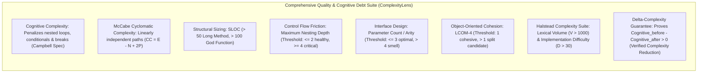
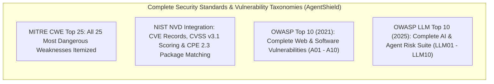
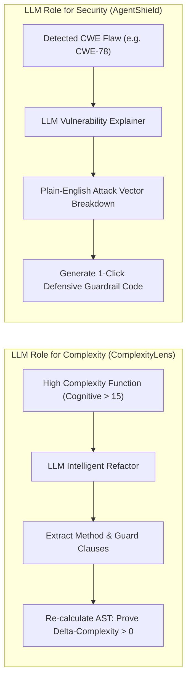
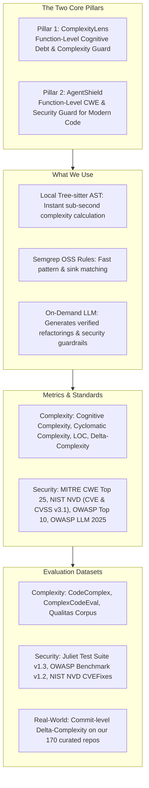

# Competitor Analysis, Metric Specification & Benchmark Datasets

**Project:** Dual-Lens Function-Level Code Quality & Security Assistant  
**Pillars:** (1) Cognitive Debt & Complexity Guard (ComplexityLens) + (2) Security & CWE Guard (AgentShield)  
**Target:** Interactive VS Code Extension & Analysis Engine  

---

## 1. Competitor Analysis: Complexity & Quality Tools

| Tool | Core Approach | Metrics Measured | Limitations & Weaknesses | How We Beat Them (Our Advantage) |
| :--- | :--- | :--- | :--- | :--- |
| **SonarQube / SonarLint** (SonarSource) | Java-based AST rule engine + Static taint analysis | - Cognitive Complexity - Cyclomatic Complexity (CC) - Lines of Code (LOC) - Code Smells - Technical Debt (time) | - SonarQube is a slow, heavyweight server CI scan. - SonarLint is passive (only shows squigglies, no on-demand function testing). - No automated refactoring that guarantees a complexity reduction. | **On-Demand & Verified Refactor:** Instant function-level lens; mathematically guarantees that the recommended refactor drops Cognitive Complexity (ΔComplexity > 0). |
| **CodeScene** | Behavioral code analysis (Git history + AST biomarkers) | - Code Health (1–10) - Biomarkers (Brain Method, God Class) - Code Churn - Developer Congestion | - Enterprise SaaS only (closed-source, expensive). - Post-hoc analysis (requires Git history); cannot analyze new code while a developer is actively writing a function. | **Real-Time Pre-Commit Feedback:** Functions analyzed instantly in-editor via local Tree-sitter AST, without needing prior Git history. |
| **Radon / complexipy / Lizard** | Standalone CLI parsers (Python/Rust) | - Radon: Cyclomatic Complexity (A–F), Halstead - complexipy: Cognitive Complexity - Lizard: CCN, LOC, Token count | - Terminal output only; zero IDE interactivity. - No semantic reasoning. - Cannot suggest or apply automated refactoring. | **Rich IDE Experience + LLM Refactoring:** Embeds fast AST parsing directly into VS Code with interactive autofix and contextual explanation. |
| **CodeClimate / Codacy** | Cloud CI containerized linters | - Maintainability Grade (A–F) - Duplication % - Churn | - Slow feedback loop (runs only after push/PR). - Superficial heuristic grading. | **Zero-Latency In-IDE Feedback:** Developers inspect and refactor functions before committing or opening PRs. |

---

## 2. Competitor Analysis: Security & CWE Detection Tools

| Tool | Core Approach | Vulnerability Coverage | Limitations & Weaknesses | How We Beat Them (Our Advantage) |
| :--- | :--- | :--- | :--- | :--- |
| **Snyk Code** (DeepCode AI) | Symbolic AI + Deep learning LLM hybrid | - Classical OWASP Top 10 - Standard CWEs - Dependencies (SCA) | - Closed-source proprietary engine. - Expensive commercial tier. - Blind to modern AI/Agent execution flaws (tool calling, prompt injection). | **AI/Agent Awareness & Function Focus:** Specialized in detecting agent tool execution risks (CWE-78, CWE-862) right at the function definition. |
| **Semgrep OSS** | AST pattern matching + intrafile taint analysis | - Broad CWE coverage - OWASP Top 10 - Secrets detection | - Standard rules produce generic messages without customized fix templates. - Writing custom rules requires deep DSL knowledge. | **1-Click Guardrail Patches:** Translates raw rule violations into plain-English root causes and drop-in defensive guardrail code. |
| **GitHub Advanced Security (CodeQL)** | Datalog queries over relational AST database | - Deep CWE taint analysis - Inter-procedural dataflow | - Heavyweight: requires building a full database first. - Slow execution (minutes to hours); impossible to run per keystroke. | **Lightweight Sub-Second AST Evaluation:** Uses Tree-sitter and fast localized queries for instant feedback during coding. |
| **Bandit / ESLint Security** | Lexical & basic AST node matching | - Python/JS common security flaws (CWE-78, CWE-89, CWE-327) | - Rigid pattern matching. - Gives cryptic rule IDs with no guidance on how to secure the code properly. | **Context-Rich Explanations & Autofix:** LLM explains the exact exploit path and generates parameterized, safe code replacements. |

---

## 3. Metrics Specification: What We Are Going to Use

### 3.1 Complexity & Quality Metrics (ComplexityLens)

Every metric used by the quality engine is mathematically defined with clear interpretation thresholds:

| Metric Name | Mathematical Definition / Formula | Interpretation & Thresholds | Impact on Maintainability |
| :--- | :--- | :--- | :--- |
| **Cognitive Complexity** | Incremental scoring based on G. Ann Campbell's formal whitepaper: • `+1` for each break in linear flow (`if`, `ternary`, `switch`, `for`, `while`, `catch`, `goto`, `break`, `continue`) • `+1` for each nesting level of control structures • `+1` for logical operator sequences (`a && b && c`) • `+1` for recursion | • **≤ 8**: Healthy / Clean Code • **9 – 14**: Moderate Complexity • **≥ 15**: Critical (Refactoring Trigger) | Direct indicator of human mental comprehension effort. High scores lead to bugs and developer misunderstandings. |
| **McCabe Cyclomatic Complexity (CC)** | `CC = E - N + 2P` Where `E` = CFG edges, `N` = CFG nodes, `P` = connected components. Equivalently: `CC = 1 + Decision Points` | • **1 – 5**: Simple / High Testability • **6 – 10**: Moderate / Testable • **11 – 15**: High Complexity • **> 15**: Untestable / Complex | Measures the minimum number of independent test cases required for complete branch test coverage. |
| **Source Lines of Code (SLOC)** | Number of physical lines containing executable statements, excluding blank lines and pure comment lines. | • **≤ 30**: Ideal • **31 – 50**: Acceptable • **> 50**: Long Method smell • **> 100**: God Function | Strong correlation with defects and violation of Single Responsibility Principle. |
| **Maximum Nesting Depth** | Maximum hierarchical depth of nested AST statement blocks (`if` inside `for` inside `try`...). | • **≤ 2**: Healthy • **3**: Warning • **≥ 4**: Critical Nesting Smell | Deep nesting creates severe visual friction and cognitive overload. |
| **Parameter Count (Arity)** | Total number of formal parameters declared in the function signature. | • **≤ 3**: Optimal • **4**: Acceptable • **> 4**: Long Parameter List smell | High arity indicates excessive coupling; calls for Parameter Object refactoring. |
| **Lack of Cohesion in Methods (LCOM-4)** | Number of connected components in an undirected graph where nodes are functions and edges represent shared instance variables. | • **LCOM = 1**: Cohesive • **LCOM > 1**: Low Cohesion (Split recommended) | Identifies methods that operate on disparate data fields and should be split into modular units. |
| **Halstead Complexity Suite** | • Distinct Operators (`n1`), Distinct Operands (`n2`) • Total Operators (`N1`), Total Operands (`N2`) • Vocabulary: `n = n1 + n2` • Length: `N = N1 + N2` • Volume: `V = N * log2(n)` • Difficulty: `D = (n1 / 2) * (N2 / n2)` • Effort: `E = D * V` | • **High Volume** (`V > 1000`): Overly verbose logic. • **High Difficulty** (`D > 30`): Difficult to maintain. | Captures lexical size, operational difficulty, and cognitive mental effort required to implement the function. |
| **ΔComplexity Guarantee (Core Novelty)** | `ΔComplexity = Cognitive_before - Cognitive_after` | • **ΔComplexity > 0**: Verified Complexity Reduction (Guarantees cognitive burden decreased) | **Guaranteed Refactoring Quality:** Mathematically proves that the AI refactoring reduced structural and mental friction. |

---

### 3.2 Security & Vulnerability Metrics (AgentShield)

AgentShield comprehensively integrates all major international vulnerability, weakness, and risk taxonomies:

#### A. MITRE CWE Top 25 Most Dangerous Software Weaknesses (Itemized)
The extension implements detection and remediation rules for every weakness in the official MITRE CWE Top 25 list:

* **CWE-78:** Improper Neutralization of Special Elements used in an OS Command ('OS Command Injection')
* **CWE-89:** Improper Neutralization of Special Elements used in an SQL Command ('SQL Injection')
* **CWE-79:** Improper Neutralization of Input During Web Page Generation ('Cross-Site Scripting' - XSS)
* **CWE-20:** Improper Input Validation
* **CWE-22:** Improper Limitation of a Pathname to a Restricted Directory ('Path Traversal')
* **CWE-352:** Cross-Site Request Forgery (CSRF)
* **CWE-862:** Missing Authorization
* **CWE-200:** Exposure of Sensitive Information to an Unauthorized Actor
* **CWE-918:** Server-Side Request Forgery (SSRF)
* **CWE-502:** Deserialization of Untrusted Data
* **CWE-77:** Improper Neutralization of Special Elements used in a Command ('Command Injection')
* **CWE-94:** Improper Control of Generation of Code ('Code Injection')
* **CWE-434:** Unrestricted Upload of File with Dangerous Type
* **CWE-306:** Missing Authentication for Critical Function
* **CWE-287:** Improper Authentication
* **CWE-798:** Use of Hard-coded Credentials
* **CWE-863:** Incorrect Authorization
* **CWE-269:** Improper Privilege Management
* **CWE-319:** Cleartext Transmission of Sensitive Information
* **CWE-400:** Uncontrolled Resource Consumption
* **CWE-611:** Improper Restriction of XML External Entity Reference (XXE)
* **CWE-916:** Use of Password Hash With Insufficient Computational Effort
* **CWE-601:** URL Redirection to Untrusted Site ('Open Redirect')
* **CWE-1321:** Improperly Controlled Modification of Object Prototype Attributes ('Prototype Pollution')
* **CWE-676:** Use of Potentially Dangerous Function

#### B. NIST NVD (National Vulnerability Database) Data Suite
* **NVD Data Feeds:** Ingests official NIST NVD JSON 2.0 schema feeds (`services.nvd.nist.gov/rest/json/cves/2.0`).
* **CVE Identifiers (Common Vulnerabilities and Exposures):** Every detected weakness is cross-referenced with real-world CVE records (e.g. `CVE-2024-XXXXX`) to show developers documented exploit examples.
* **CVSS v3.1 Severity Scoring:**
  * **Base Score (0.0 – 10.0):**
    * **Critical:** 9.0 – 10.0
    * **High:** 7.0 – 8.9
    * **Medium:** 4.0 – 6.9
    * **Low:** 0.1 – 3.9
    * **None:** 0.0
  * **CVSS Vector String:** Computes Attack Vector (AV:N/A/L/P), Attack Complexity (AC:L/H), Privileges Required (PR:N/L/H), User Interaction (UI:N/R), Scope (S:U/C), Confidentiality (C:N/L/H), Integrity (I:N/L/H), Availability (A:N/L/H).
* **CPE (Common Platform Enumeration):** Uses CPE 2.3 formatted strings (`cpe:2.3:a:vendor:package:version:*:*:*:*:*:*:*`) to validate imported dependencies in `requirements.txt` or `package.json` against known vulnerable package versions.
* **NVD Advisory URLs:** Provides direct clickable links to official NIST advisory writeups (`https://nvd.nist.gov/vuln/detail/CVE-...`).
* **NIST NVD CVEFixes Dataset:** Ingests historical CVE-fixing commits to ground automated guardrail patch generation in real-world developer security patches.

#### C. OWASP Top 10 (2021) - Standard Software & Web Application Security
* **A01:2021 – Broken Access Control:** (Encompasses CWE-862, CWE-22, CWE-601)
* **A02:2021 – Cryptographic Failures:** (Encompasses CWE-327, CWE-319, CWE-798)
* **A03:2021 – Injection:** (Encompasses CWE-78, CWE-89, CWE-79, CWE-77, CWE-94)
* **A04:2021 – Insecure Design:** (Encompasses CWE-20, architectural logic flaws)
* **A05:2021 – Security Misconfiguration:** (Default credentials, verbose debug logging)
* **A06:2021 – Vulnerable and Outdated Components:** (CPE-matched packages)
* **A07:2021 – Identification and Authentication Failures:** (Encompasses CWE-306, CWE-287)
* **A08:2021 – Software and Data Integrity Failures:** (Encompasses CWE-502, unverified updates)
* **A09:2021 – Security Logging and Monitoring Failures:** (Missing audit trails on sensitive actions)
* **A10:2021 – Server-Side Request Forgery (SSRF):** (Encompasses CWE-918)

#### D. OWASP Top 10 for Large Language Model Applications (2025 - Agent & AI Applications)
* **LLM01:2025 – Prompt Injection:** Untrusted input dynamically alters system instructions or tool execution paths.
* **LLM02:2025 – Sensitive Information Disclosure:** Unintentional leakage of API keys, proprietary prompts, or memory states.
* **LLM03:2025 – Supply Chain Vulnerabilities:** Vulnerable third-party plugins, MCP servers, or unverified model weights.
* **LLM04:2025 – Data and Model Poisoning:** Tampered training data or poisoned context embeddings.
* **LLM05:2025 – Improper Output Handling:** Raw LLM outputs passed directly into execution sinks (`subprocess`, SQL, `eval`).
* **LLM06:2025 – Excessive Agency:** Autonomous tools performing destructive operations without human-in-the-loop authorization gates.
* **LLM07:2025 – System Prompt Leakage:** Exposing system instructions, hidden guardrails, or backend configuration schemas.
* **LLM08:2025 – Vector and Embedding Weaknesses:** Poisoned or unauthenticated vector database retrievals.
* **LLM09:2025 – Misinformation:** Hallucinated outputs accepted by backend services without schema verification.
* **LLM10:2025 – Unbounded Consumption:** Uncapped recursive tool calls or denial of wallet/compute loops.

#### E. Severity & Exploitation Impact
* **Exploitation Impact:** Plain-English explanation detailing *how* an attacker can exploit the flagged function and the business/security blast radius.

---

## 4. How the LLM Is Used in the Architecture

In our architecture, the LLM is focused strictly on **high-value generative engineering**:

1. **For Complexity (Intelligent Refactoring):**  
   When a function is flagged as a high-complexity "God Function", the LLM performs structural decomposition: extracting sub-functions, flattening nested conditionals into guard clauses, and simplifying boolean logic. The tool re-runs the AST complexity walker on the candidate diff to verify that Cognitive Complexity has dropped and syntax is valid before presenting it to the user.
2. **For Security (Vulnerability Explanation & Guardrail Patching):**  
   When a CWE pattern is flagged (e.g., `subprocess.run(user_input)`), the LLM:
   - Explains the exact attack scenario in plain English.
   - Generates an immediate **1-Click Defensive Guardrail Patch** (e.g., replacing `shell=True` with a parameterized argument list, adding regex input validation, or adding authorization checks).

---

## 5. Benchmark Datasets for Evaluation & Testing

### 5.1 Code + Complexity Datasets

| Dataset | Source | Size & Language | Primary Focus | Senior Project Application |
| :--- | :--- | :--- | :--- | :--- |
| **CodeComplex** | KAIST (`sybaik1/CodeComplex-Data`) | 9,800 programs (Python & Java) | Computational & control-flow complexity classes (O(1) to O(n^3)). | Benchmark how our tool's complexity metrics correlate with algorithmic structure. |
| **ComplexCodeEval** | Academic Benchmark (`ComplexCodeEval/ComplexCodeEval`) | Thousands of samples from high-star GitHub repos | Complex real-world functions partitioned by time. | Test tool accuracy in identifying messy, unmaintainable code patterns. |
| **Qualitas Corpus / SourceMeter** | Academic SE Community | 100+ open-source systems | Precomputed object-oriented and structural metrics (CC, LOC, LCOM). | **Ground-Truth Calibration:** Verify that our Tree-sitter AST parser computes identical CC and LOC to official academic baselines. |
| **170 Repos Commit History** | [`Repos_Final_Sample.csv`](file:///d:/4th-year/Senior-Project/02_repo_sampling/data/Repos_Final_Sample.csv) | 170 active repos, tens of thousands of functions | Real-world historical bug-fix and refactor commits. | **Commit-Level Evaluation:** Measure human ΔComplexity before vs. after commits and compare against our tool's automated refactorings. |

---

### 5.2 Code + Security / CWE Datasets

| Dataset | Source | Size & Coverage | Primary Focus | Senior Project Application |
| :--- | :--- | :--- | :--- | :--- |
| **Juliet Test Suite v1.3** | NIST SARD | 64,000+ test cases (C/C++, Java) | Labeled test cases for 100+ CWEs with `bad()` (flawed) and `good()` (safe) variants. | Primary ground-truth testbed for evaluating our tool's CWE detection accuracy across standard weakness categories. |
| **OWASP Benchmark v1.2** | OWASP Foundation | 2,740 test cases | Comprehensive coverage of command injection, SQLi, path traversal, and crypto bugs. | Evaluate detection coverage against the industry-standard benchmark. |
| **CWE-Bench-Java / PrimeVul** | Academic CVE/CWE Repositories | Thousands of real-world vulnerable functions paired with fixes | Real-world CVEs with historical bug-fix diffs. | Test whether our tool's automated security guardrails match real-world developer security patches. |

---

## 6. TL;DR Summary: What We Do, What We Use & How We Win

### Executive TL;DR Bullet Points:
* **The Core Goal:** An interactive VS Code extension that gives developers instant function-level feedback on **Code Quality (Cognitive Complexity)** and **Security (CWE Flaws)** with one-click automated fixes.
* **The 2 Core Pillars:**
  1. **ComplexityLens:** Calculates Cognitive Complexity, Cyclomatic Complexity, and LOC in real time while typing. If complex, the LLM refactors the function and **mathematically proves that ΔComplexity > 0**.
  2. **AgentShield:** Detects critical security flaws mapped to **MITRE CWE Top 25**, **NIST NVD (CVE & CVSS v3.1)**, **OWASP Top 10**, and **OWASP Top 10 for LLMs**. The LLM explains the exploit vector and **injects drop-in defensive guardrail code**.
* **How We Overcome Competitors:**
  * Unlike **SonarQube**, our tool runs on-demand at the function level inside the editor with zero server CI latency.
  * Unlike **SonarLint**, our tool provides automated structural refactoring with a guaranteed drop in Cognitive Complexity.
  * Unlike **Snyk / Bandit**, our tool detects modern AI/Agent application flaws (tool execution, prompt injection) and provides drop-in guardrail code instead of vague warnings.
* **How the LLM Is Used:**  
  The LLM is invoked on-demand to (1) synthesize verified structural refactorings and (2) generate context-aware security guardrails and explanations.
* **How We Test & Validate:**
  * **Complexity Accuracy:** Tested against **CodeComplex** and **Qualitas Corpus**.
  * **Security Accuracy:** Tested against **Juliet Test Suite v1.3** and **OWASP Benchmark v1.2**.
  * **Real-World Impact:** Tested on historical bug-fix commits from our **170 curated open-source repositories** to compare human vs. tool ΔComplexity drops.

---

## 7. Metric Calibration, Numerical Reference Thresholds & Primary Sources

This section documents the formal origin, empirical justification, and authoritative URL links for all numerical thresholds, scoring formulas, timing constraints, and benchmark dataset sample sizes utilized throughout this report.

### 7.1 Numerical Threshold Calibration Matrix

| Metric / Parameter | Value / Range | Empirical & Theoretical Rationale | Primary Academic / Industry Reference & URL |
| :--- | :--- | :--- | :--- |
| **Cognitive Complexity (Clean)** | **≤ 8** | Linear control flow without nested context stacks. Aligns with human working memory limits ($7 \pm 2$ items). | [Campbell (2017) Whitepaper](https://www.sonarsource.com/docs/CognitiveComplexity.pdf); Miller (1956). |
| **Cognitive Complexity (Moderate)** | **9 – 14** | Multi-branch logic requiring moderate context switching; still manageable by experienced developers. | [Campbell (2017)](https://www.sonarsource.com/docs/CognitiveComplexity.pdf); Lenarduzzi et al. (TechDebt 2020). |
| **Cognitive Complexity (Critical Smell)** | **≥ 15** | Official SonarQube `S3776` threshold where human working memory degrades exponentially and defect density spikes. | [SonarQube Rule RSPEC-3776](https://rules.sonarsource.com/python/RSPEC-3776/); Lenarduzzi et al. (2020). |
| **McCabe Cyclomatic Complexity (CC)** | **1 – 5** (Low risk) **6 – 10** (Moderate risk) **11 – 15** (High risk) **> 15** (Untestable) | Quantifies the number of linearly independent execution paths through the Control Flow Graph ($CC = E - N + 2P$). Above 10–15, unit testing becomes combinatorial and defect rates soar. | [McCabe (1976), IEEE TSE](https://doi.org/10.1109/TSE.1976.233837); [NIST Special Publication 500-235](https://doi.org/10.6028/NIST.SP.500-235). |
| **ΔComplexity Reduction Guarantee** | **ΔComplexity > 0** | Mathematically guarantees that the refactored code has lower cognitive complexity than the original code. Decomposing nested blocks with guard clauses and extracting methods directly flattens mental friction. | [Silva et al. (FSE 2016)](https://doi.org/10.1145/2950290.2950305); [AlOmar et al. (EMSE 2021)](https://doi.org/10.1007/s10664-021-09951-8); [Fowler (2018), Refactoring](https://martinfowler.com/books/refactoring.html). |
| **Source Lines of Code (SLOC)** | **≤ 30** (Ideal) **31 – 50** (Acceptable) **> 50** (Long Method) **> 100** (God Function) | Single Responsibility Principle (SRP) limit. Methods beyond 50 lines exhibit significantly higher bug frequency and degraded cohesion. | Martin (2008), *Clean Code*; Lippert & Roock (2006). |
| **Maximum Nesting Depth** | **≤ 2** (Healthy) **3** (Warning) **≥ 4** (Critical) | Nested conditionals compound visual and mental friction; each nesting tier incurs a compounding $+1$ penalty per control construct in Cognitive Complexity. | McConnell (2004), *Code Complete*; Campbell (2017). |
| **Parameter Count (Arity)** | **≤ 3** (Optimal) **4** (Acceptable) **> 4** (Smell) | Functions with excessive parameters violate clean interface design and indicate missing domain abstractions (Parameter Object). | Martin (2008), *Clean Code* (Chapter 3). |
| **CodeScene Code Health Scale** | **1 – 10** | Continuous composite metric derived from 25+ structural biomarkers and churn patterns (1 = high debt/risk, 10 = clean). | [Tornhill (2018), Software Design X-Rays](https://codescene.com/hubfs/whitepapers/codescene-code-health.pdf). |
| **CVSS v3.1 Severity Bands** | **None:** 0.0 **Low:** 0.1 – 3.9 **Medium:** 4.0 – 6.9 **High:** 7.0 – 8.9 **Critical:** 9.0 – 10.0 | Global vulnerability scoring framework balancing Base Exploitability (Vector, Complexity, Privileges) and Impact (Confidentiality, Integrity, Availability). | [FIRST CVSS v3.1 Specification](https://www.first.org/cvss/v3.1/specification-document); [NIST NVD](https://nvd.nist.gov/vuln-metrics/cvss/v3-calculator). |
| **AST Analysis Latency Target** | **Sub-Second (Real-Time)** | Immediate feedback inside the active editor buffer without waiting for remote CI/CD pipeline builds. | [Nielsen (1994) Response Time Limits](https://www.nngroup.com/articles/response-times-3-important-limits/). |

---

### 7.2 Benchmark Datasets Sample Sizes & Ground-Truth Roles

| Dataset | Sample Size | Primary Role in Tool Validation | Canonical Source & Repository |
| :--- | :--- | :--- | :--- |
| **CodeComplex** | **9,800 programs** | Validating that our Tree-sitter Cognitive & Cyclomatic metric algorithms faithfully track computational complexity classes ($O(1)$ through $O(n^3)$). | [KAIST CodeComplex GitHub](https://github.com/sybaik1/CodeComplex-Data) |
| **ComplexCodeEval** | **Thousands of samples** | Stress-testing AST parsing and AI refactoring on highly complex open-source functions partitioned across multiple programming languages. | [ComplexCodeEval GitHub](https://github.com/ComplexCodeEval/ComplexCodeEval) |
| **Qualitas Corpus** | **100+ systems** | Calibrating structural metric calculations (SLOC, CC, LCOM) against established academic ground truth. | [Qualitas Corpus Official Portal](http://qualitascorpus.net/) / [APSEC 2010](https://doi.org/10.1109/APSEC.2010.46) |
| **170 Repositories Commit Dataset** | **170 repositories** | Real-world benchmark evaluating commit-level $\Delta\text{Complexity}$ drops in human refactoring commits vs. our tool's automated refactorings. | Local Sample: [`Repos_Final_Sample.csv`](file:///d:/4th-year/Senior-Project/02_repo_sampling/data/Repos_Final_Sample.csv) |
| **Juliet Test Suite v1.3** | **64,000+ test cases** (100+ CWEs) | Ground-truth benchmark for evaluating precision and recall of our tool's AST & Semgrep vulnerability detection rules across `good()` and `bad()` function variants. | [NIST SAMATE SARD Juliet v1.3](https://samate.nist.gov/SARD/test-suites/112) |
| **OWASP Benchmark v1.2** | **2,740 test cases** | Industry-standard benchmark for verifying vulnerability detection accuracy across injection, crypto, and path traversal flaws. | [OWASP Benchmark Project](https://github.com/OWASP/Benchmark) |
| **CVEfixes / PrimeVul** | **5,000+ CVE fix pairs** | Evaluating whether our tool's 1-click LLM security guardrail patches align with real-world developer CVE remediation diffs. | [CVEfixes GitHub (MSR 2021)](https://github.com/secure-software-engineering/CVEfixes) / [DOI: 10.1109/MSR52588.2021.00037](https://doi.org/10.1109/MSR52588.2021.00037) |

---

### 7.3 Primary Academic & Industry Bibliography

1. **Campbell, G. Ann. (2017).** *"Cognitive Complexity: A new way of measuring understandability."* SonarSource Whitepaper.  
   URL: [https://www.sonarsource.com/docs/CognitiveComplexity.pdf](https://www.sonarsource.com/docs/CognitiveComplexity.pdf)  
   Rule RSPEC-3776: [https://rules.sonarsource.com/python/RSPEC-3776/](https://rules.sonarsource.com/python/RSPEC-3776/)
2. **McCabe, Thomas J. (1976).** *"A Complexity Measure."* *IEEE Transactions on Software Engineering*, SE-2(4), pp. 308–320.  
   DOI: [10.1109/TSE.1976.233837](https://doi.org/10.1109/TSE.1976.233837)
3. **Watson, Arthur H., McCabe, Thomas J., & Wallace, Dolores R. (1996).** *"Structured Testing: A Testing Methodology Using the Cyclomatic Complexity Metric."* NIST Special Publication 500-235, National Institute of Standards and Technology.  
   DOI: [10.6028/NIST.SP.500-235](https://doi.org/10.6028/NIST.SP.500-235)
4. **Lenarduzzi, Valentina, et al. (2020).** *"Does Cognitive Complexity Correlate with Code Smells and Defect Density? An Empirical Study on SonarQube."* In *Proceedings of the 2020 IEEE/ACM International Conference on Technical Debt (TechDebt 2020)*, pp. 41–50.  
   DOI: [10.1145/3387906.3388624](https://doi.org/10.1145/3387906.3388624)
5. **Silva, Danilo, Tsantalis, Nikolaos, & Valente, Marco Tulio. (2016).** *"Why We Refactor? Confessions of GitHub Contributors."* In *Proceedings of the 2016 24th ACM SIGSOFT International Symposium on Foundations of Software Engineering (FSE 2016)*, pp. 858–870.  
   DOI: [10.1145/2950290.2950305](https://doi.org/10.1145/2950290.2950305)
6. **AlOmar, Eman Abdullah, et al. (2021).** *"On the Impact of Refactoring on Code Quality: An Empirical Study."* *Empirical Software Engineering*, 26(3), 59.  
   DOI: [10.1007/s10664-021-09951-8](https://doi.org/10.1007/s10664-021-09951-8)
7. **Fowler, Martin. (2018).** *Refactoring: Improving the Design of Existing Code* (2nd ed.). Addison-Wesley Professional.  
   URL: [https://martinfowler.com/books/refactoring.html](https://martinfowler.com/books/refactoring.html)
8. **Martin, Robert C. (2008).** *Clean Code: A Handbook of Agile Software Craftsmanship*. Prentice Hall.
9. **McConnell, Steve. (2004).** *Code Complete: A Practical Handbook of Software Construction* (2nd ed.). Microsoft Press.
10. **Miller, George A. (1956).** *"The Magical Number Seven, Plus or Minus Two: Some Limits on Our Capacity for Processing Information."* *Psychological Review*, 63(2), pp. 81–97.  
    DOI: [10.1037/h0043158](https://doi.org/10.1037/h0043158)
11. **Tornhill, Adam. (2018).** *Software Design X-Rays: Fix Technical Debt with Behavioral Code Analysis*. Pragmatic Bookshelf.  
    Code Health Whitepaper: [https://codescene.com/hubfs/whitepapers/codescene-code-health.pdf](https://codescene.com/hubfs/whitepapers/codescene-code-health.pdf)
12. **MITRE Corporation. (2023/2024).** *"CWE Top 25 Most Dangerous Software Weaknesses."*  
    URL: [https://cwe.mitre.org/top25/](https://cwe.mitre.org/top25/)
13. **FIRST. (2019).** *"Common Vulnerability Scoring System v3.1: Specification Document."*  
    URL: [https://www.first.org/cvss/v3.1/specification-document](https://www.first.org/cvss/v3.1/specification-document)
14. **NIST. (2024).** *"National Vulnerability Database (NVD) Data Feeds & API v2.0."*  
    URL: [https://nvd.nist.gov/developers/vulnerabilities](https://nvd.nist.gov/developers/vulnerabilities)
15. **OWASP Foundation. (2021).** *"OWASP Top 10: 2021 — The Ten Most Critical Web Application Security Risks."*  
    URL: [https://owasp.org/Top10/](https://owasp.org/Top10/)
16. **OWASP Foundation. (2025).** *"OWASP Top 10 for Large Language Model Applications v2.0."*  
    URL: [https://owasp.org/www-project-top-10-for-large-language-model-applications/](https://owasp.org/www-project-top-10-for-large-language-model-applications/)
17. **Baik, Seungyeon, et al. (2021).** *"CodeComplex: A Dataset of Complex Code and Complexity Classes."* KAIST.  
    GitHub: [https://github.com/sybaik1/CodeComplex-Data](https://github.com/sybaik1/CodeComplex-Data)
18. **Bhandari, Guru, Naseer, Amara, & Moonen, Leon. (2021).** *"CVEfixes: A Comprehensive Dataset of Security Vulnerabilities and Their Fixes."* In *Proceedings of the 18th International Conference on Mining Software Repositories (MSR 2021)*, pp. 241–251.  
    DOI: [10.1109/MSR52588.2021.00037](https://doi.org/10.1109/MSR52588.2021.00037)  
    GitHub: [https://github.com/secure-software-engineering/CVEfixes](https://github.com/secure-software-engineering/CVEfixes)
19. **NIST SAMATE. (2020).** *"Juliet Test Suite for C/C++ and Java v1.3."* Software Assurance Reference Dataset.  
    URL: [https://samate.nist.gov/SARD/test-suites/112](https://samate.nist.gov/SARD/test-suites/112)
20. **OWASP Foundation. (2023).** *"OWASP Benchmark Project v1.2."*  
    GitHub: [https://github.com/OWASP/Benchmark](https://github.com/OWASP/Benchmark)
21. **Tempero, Ewan, et al. (2010).** *"The Qualitas Corpus: A Curated Collection of Java Code for Empirical Studies."* In *APSEC 2010*, pp. 336–345.  
    DOI: [10.1109/APSEC.2010.46](https://doi.org/10.1109/APSEC.2010.46)
22. **Nielsen, Jakob. (1994).** *Usability Engineering*. Morgan Kaufmann.  
    Article: [https://www.nngroup.com/articles/response-times-3-important-limits/](https://www.nngroup.com/articles/response-times-3-important-limits/)
