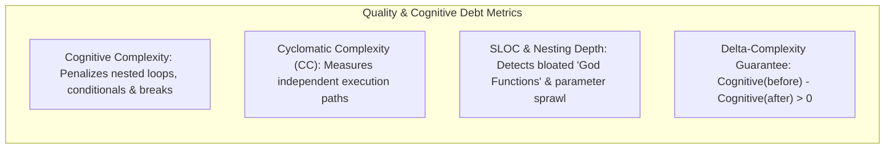
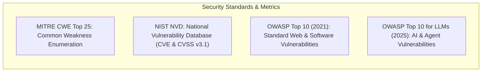
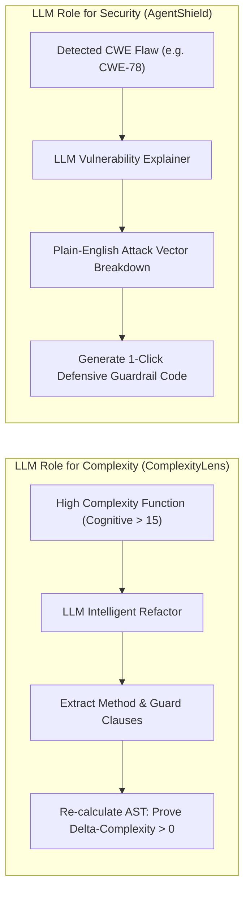
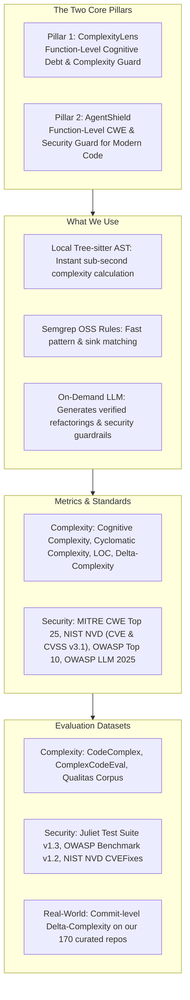

# Competitor Analysis, Metric Specification & Benchmark Datasets

**Project:** Dual-Lens Function-Level Code Quality & Security Assistant  
**Pillars:** (1) Cognitive Debt & Complexity Guard (ComplexityLens) + (2) Security & CWE Guard (AgentShield)  
**Target:** Interactive VS Code Extension & Analysis Engine  

---

## 1. Competitor Analysis: Complexity & Quality Tools

| Tool | Core Approach | Metrics Measured | Limitations & Weaknesses | How We Beat Them (Our Advantage) |
| :--- | :--- | :--- | :--- | :--- |
| **SonarQube / SonarLint** (SonarSource) | Java-based AST rule engine + Static taint analysis | - Cognitive Complexity - Cyclomatic Complexity (CC) - Lines of Code (LOC) - Code Smells - Technical Debt (time) | - SonarQube is a slow, heavyweight server CI scan. - SonarLint is passive (only shows squigglies, no on-demand function testing). - No automated refactoring that guarantees a complexity reduction. | **On-Demand & Verified Refactor:** Instant function-level lens; mathematically guarantees that the recommended refactor drops Cognitive Complexity (ΔComplexity > 0). |
| **CodeScene** | Behavioral code analysis (Git history + AST biomarkers) | - Code Health (1–10) - Biomarkers (Brain Method, God Class) - Code Churn - Developer Congestion | - Enterprise SaaS only (closed-source, expensive). - Post-hoc analysis (requires Git history); cannot analyze new code while a developer is actively writing a function. | **Real-Time Pre-Commit Feedback:** Functions analyzed instantly in-editor via local Tree-sitter AST, without needing prior Git history. |
| **Radon / complexipy / Lizard** | Standalone CLI parsers (Python/Rust) | - Radon: Cyclomatic Complexity (A–F), Halstead - complexipy: Cognitive Complexity - Lizard: CCN, LOC, Token count | - Terminal output only; zero IDE interactivity. - No semantic reasoning. - Cannot suggest or apply automated refactoring. | **Rich IDE Experience + LLM Refactoring:** Embeds fast AST parsing directly into VS Code with interactive autofix and contextual explanation. |
| **CodeClimate / Codacy** | Cloud CI containerized linters | - Maintainability Grade (A–F) - Duplication % - Churn | - Slow feedback loop (runs only after push/PR). - Superficial heuristic grading. | **Zero-Latency In-IDE Feedback:** Developers inspect and refactor functions before committing or opening PRs. |

---

## 2. Competitor Analysis: Security & CWE Detection Tools

| Tool | Core Approach | Vulnerability Coverage | Limitations & Weaknesses | How We Beat Them (Our Advantage) |
| :--- | :--- | :--- | :--- | :--- |
| **Snyk Code** (DeepCode AI) | Symbolic AI + Deep learning LLM hybrid | - Classical OWASP Top 10 - Standard CWEs - Dependencies (SCA) | - Closed-source proprietary engine. - Expensive commercial tier. - Blind to modern AI/Agent execution flaws (tool calling, prompt injection). | **AI/Agent Awareness & Function Focus:** Specialized in detecting agent tool execution risks (CWE-78, CWE-862) right at the function definition. |
| **Semgrep OSS** | AST pattern matching + intrafile taint analysis | - Broad CWE coverage - OWASP Top 10 - Secrets detection | - Standard rules produce generic messages without customized fix templates. - Writing custom rules requires deep DSL knowledge. | **1-Click Guardrail Patches:** Translates raw rule violations into plain-English root causes and drop-in defensive guardrail code. |
| **GitHub Advanced Security (CodeQL)** | Datalog queries over relational AST database | - Deep CWE taint analysis - Inter-procedural dataflow | - Heavyweight: requires building a full database first. - Slow execution (minutes to hours); impossible to run per keystroke. | **Lightweight Sub-Second AST Evaluation:** Uses Tree-sitter and fast localized queries for instant feedback during coding. |
| **Bandit / ESLint Security** | Lexical & basic AST node matching | - Python/JS common security flaws (CWE-78, CWE-89, CWE-327) | - Rigid pattern matching. - Gives cryptic rule IDs with no guidance on how to secure the code properly. | **Context-Rich Explanations & Autofix:** LLM explains the exact exploit path and generates parameterized, safe code replacements. |

---

## 3. Metrics Specification: What We Are Going to Use

### 3.1 Complexity & Quality Metrics (ComplexityLens)

1. **Cognitive Complexity (G. Ann Campbell Specification):**  
   Measures the mental effort required to understand code by penalizing nested structures (`if`, `for`, `while`, `catch`), ternary operators, and logical operator sequences.
2. **Cyclomatic Complexity (McCabe CC = E - N + 2P):**  
   Measures the number of linearly independent paths through the control flow graph.
3. **Source Lines of Code (SLOC) & Nesting Depth:**  
   Identifies oversized methods (> 50 lines), parameter bloat (> 4 arguments), and deep indentation (> 3 levels).
4. **ΔComplexity Guarantee (Our Core Novelty):**  
   Every AI-generated refactoring must satisfy:
   `ΔComplexity = Cognitive_before - Cognitive_after > 0`
   proving mathematically that the refactoring reduced cognitive load.

---

### 3.2 Security & Vulnerability Metrics (AgentShield)

#### A. MITRE CWE Top 25 Most Dangerous Weaknesses Mapped
* **CWE-78 / CWE-77 (OS Command Injection):** Untrusted input passed directly into `subprocess`, `os.system`, or shell execution tools.
* **CWE-89 (SQL Injection):** Dynamic string concatenation in SQL queries without parameterization.
* **CWE-79 (Cross-Site Scripting - XSS):** Unsanitized outputs rendered into web views or desktop agent interfaces.
* **CWE-20 (Improper Input Validation):** Function accepts external/user arguments without validation schemas (e.g. missing Pydantic/Zod).
* **CWE-22 (Path Traversal):** Unsanitized file paths allowing access outside target directories (`../`).
* **CWE-862 (Missing Authorization):** Autonomous agent actions executing sensitive write/delete operations without authorization.
* **CWE-200 (Exposure of Sensitive Information):** Hardcoded secrets, API tokens, or memory context leakage.
* **CWE-918 (Server-Side Request Forgery - SSRF):** Web scrapers or fetch tools accessing internal network endpoints (`http://169.254.169.254`).
* **CWE-502 (Deserialization of Untrusted Data):** Unsafe `pickle.loads()` or YAML `load()`.
* **CWE-94 (Code Injection):** Use of `eval()` or `exec()` on dynamic strings.
* **CWE-434 (Unrestricted File Upload):** Uploading executable scripts without type verification.
* **CWE-306 (Missing Authentication for Critical Function):** Sensitive handler endpoints without access guards.

#### B. OWASP Top 10 (Standard Web/Software Application Security)
* **A01: Broken Access Control** (CWE-862, CWE-22)
* **A02: Cryptographic Failures** (CWE-327, CWE-200)
* **A03: Injection** (CWE-78, CWE-89, CWE-79)
* **A04: Insecure Design**
* **A05: Security Misconfiguration**
* **A06: Vulnerable and Outdated Components**
* **A07: Identification and Authentication Failures** (CWE-306)
* **A08: Software and Data Integrity Failures** (CWE-502)
* **A09: Security Logging and Monitoring Failures**
* **A10: Server-Side Request Forgery (SSRF)** (CWE-918)

#### C. OWASP Top 10 for LLMs (2025 - Agent & AI Applications)
* **LLM01: Prompt Injection:** Untrusted inputs manipulate system instructions.
* **LLM02: Sensitive Information Disclosure:** Leaking API keys, prompt context, or internal data.
* **LLM05: Insecure Output Handling:** LLM text passed unchecked into execution sinks (`subprocess`, SQL).
* **LLM06: Excessive Agency:** Autonomous tools performing destructive operations without human-in-the-loop gates.
* **LLM07: System Prompt Leakage:** Exposing system prompts or internal operational schemas.

#### D. NIST NVD (National Vulnerability Database) Integration
* **CVE to CWE Mapping:** Maps detected function weaknesses to historical real-world CVE records in the NVD data feed, giving developers concrete examples of past exploits.
* **CVSS v3.1 Severity Scoring:** Computes and displays official CVSS metrics:
  - **Base Score (0.0 – 10.0):** Categorized into Critical (9.0 – 10.0), High (7.0 – 8.9), Medium (4.0 – 6.9), and Low (0.1 – 3.9).
  - **Vector Metrics:** Evaluates Attack Vector (AV), Attack Complexity (AC), and Privileges Required (PR).
* **NVD Advisory URLs:** Provides direct clickable links to official NIST NVD vulnerability records (`https://nvd.nist.gov/vuln/detail/CVE-...`).
* **CPE Package Cross-Referencing:** Matches function imports against NVD's Common Platform Enumeration (CPE) to flag known vulnerable or outdated library dependencies.

#### E. Severity & Exploitation Impact
* **Exploitation Impact:** Plain-English explanation detailing *how* an attacker can exploit the flagged function and the business/security blast radius.

---

## 4. How the LLM Is Used in the Architecture

In our architecture, the LLM is focused strictly on **high-value generative engineering**:

1. **For Complexity (Intelligent Refactoring):**  
   When a function is flagged as a high-complexity "God Function", the LLM performs structural decomposition: extracting sub-functions, flattening nested conditionals into guard clauses, and simplifying boolean logic. The tool re-runs the AST complexity walker on the candidate diff to verify that Cognitive Complexity has dropped and syntax is valid before presenting it to the user.
2. **For Security (Vulnerability Explanation & Guardrail Patching):**  
   When a CWE pattern is flagged (e.g., `subprocess.run(user_input)`), the LLM:
   - Explains the exact attack scenario in plain English.
   - Generates an immediate **1-Click Defensive Guardrail Patch** (e.g., replacing `shell=True` with a parameterized argument list, adding regex input validation, or adding authorization checks).

---

## 5. Benchmark Datasets for Evaluation & Testing

### 5.1 Code + Complexity Datasets

| Dataset | Source | Size & Language | Primary Focus | Senior Project Application |
| :--- | :--- | :--- | :--- | :--- |
| **CodeComplex** | KAIST (`sybaik1/CodeComplex-Data`) | 9,800 programs (Python & Java) | Computational & control-flow complexity classes (O(1) to O(n^3)). | Benchmark how our tool's complexity metrics correlate with algorithmic structure. |
| **ComplexCodeEval** | Academic Benchmark (`ComplexCodeEval/ComplexCodeEval`) | Thousands of samples from high-star GitHub repos | Complex real-world functions partitioned by time. | Test tool accuracy in identifying messy, unmaintainable code patterns. |
| **Qualitas Corpus / SourceMeter** | Academic SE Community | 100+ open-source systems | Precomputed object-oriented and structural metrics (CC, LOC, LCOM). | **Ground-Truth Calibration:** Verify that our Tree-sitter AST parser computes identical CC and LOC to official academic baselines. |
| **170 Repos Commit History** | [`Repos_Final_Sample.csv`](file:///d:/4th-year/Senior-Project/02_repo_sampling/data/Repos_Final_Sample.csv) | 170 active repos, tens of thousands of functions | Real-world historical bug-fix and refactor commits. | **Commit-Level Evaluation:** Measure human ΔComplexity before vs. after commits and compare against our tool's automated refactorings. |

---

### 5.2 Code + Security / CWE Datasets

| Dataset | Source | Size & Coverage | Primary Focus | Senior Project Application |
| :--- | :--- | :--- | :--- | :--- |
| **Juliet Test Suite v1.3** | NIST SARD | 64,000+ test cases (C/C++, Java) | Labeled test cases for 100+ CWEs with `bad()` (flawed) and `good()` (safe) variants. | Primary ground-truth testbed for evaluating our tool's CWE detection accuracy across standard weakness categories. |
| **OWASP Benchmark v1.2** | OWASP Foundation | 2,740 test cases | Comprehensive coverage of command injection, SQLi, path traversal, and crypto bugs. | Evaluate detection coverage against the industry-standard benchmark. |
| **CWE-Bench-Java / PrimeVul** | Academic CVE/CWE Repositories | Thousands of real-world vulnerable functions paired with fixes | Real-world CVEs with historical bug-fix diffs. | Test whether our tool's automated security guardrails match real-world developer security patches. |

---

## 6. TL;DR Summary: What We Do, What We Use & How We Win

### Executive TL;DR Bullet Points:
* **The Core Goal:** An interactive VS Code extension that gives developers instant function-level feedback on **Code Quality (Cognitive Complexity)** and **Security (CWE Flaws)** with one-click automated fixes.
* **The 2 Core Pillars:**
  1. **ComplexityLens:** Calculates Cognitive Complexity, Cyclomatic Complexity, and LOC in < 20ms. If complex, the LLM refactors the function and **mathematically proves that ΔComplexity > 0**.
  2. **AgentShield:** Detects critical security flaws mapped to **MITRE CWE Top 25**, **NIST NVD (CVE & CVSS v3.1)**, **OWASP Top 10**, and **OWASP Top 10 for LLMs**. The LLM explains the exploit vector and **injects drop-in defensive guardrail code**.
* **How We Overcome Competitors:**
  * Unlike **SonarQube**, our tool runs on-demand at the function level inside the editor with zero server CI latency.
  * Unlike **SonarLint**, our tool provides automated structural refactoring with a guaranteed drop in Cognitive Complexity.
  * Unlike **Snyk / Bandit**, our tool detects modern AI/Agent application flaws (tool execution, prompt injection) and provides drop-in guardrail code instead of vague warnings.
* **How the LLM Is Used:**  
  The LLM is invoked on-demand to (1) synthesize verified structural refactorings and (2) generate context-aware security guardrails and explanations.
* **How We Test & Validate:**
  * **Complexity Accuracy:** Tested against **CodeComplex** and **Qualitas Corpus**.
  * **Security Accuracy:** Tested against **Juliet Test Suite v1.3** and **OWASP Benchmark v1.2**.
  * **Real-World Impact:** Tested on historical bug-fix commits from our **170 curated open-source repositories** to compare human vs. tool ΔComplexity drops.
