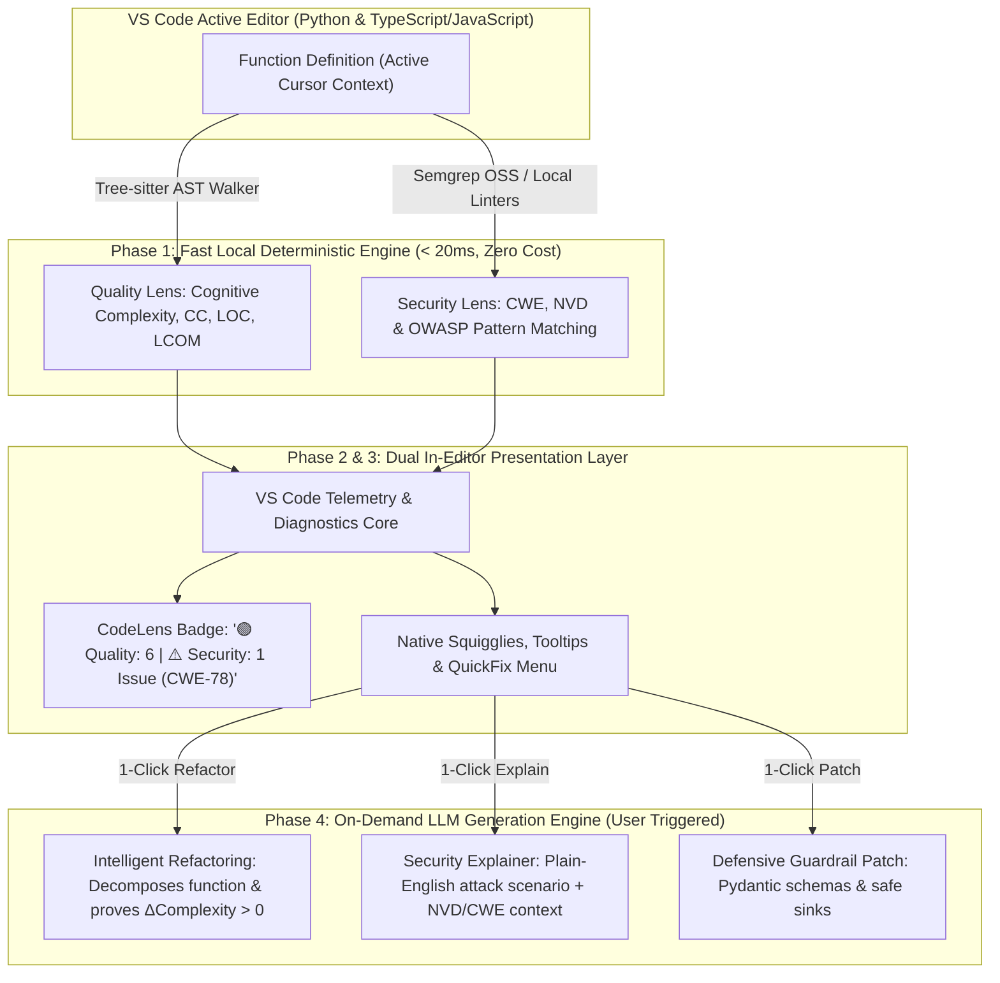
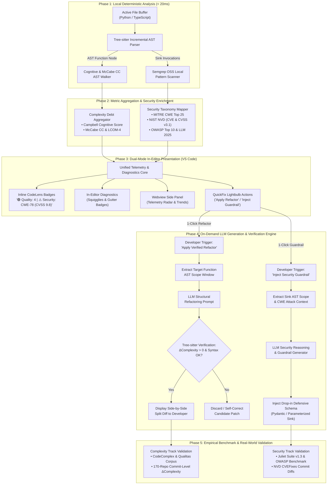
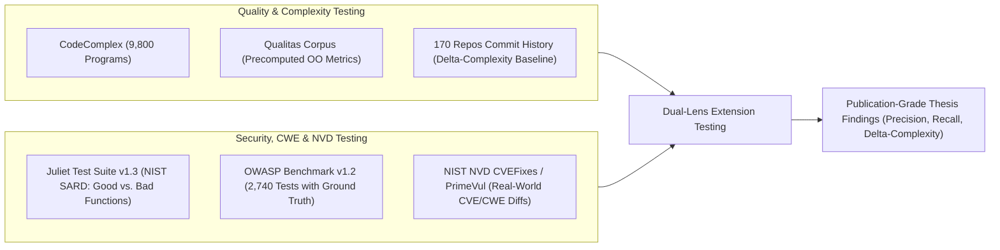
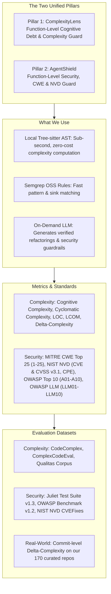

# Master Project Specification: Dual-Lens Code Quality & Security Assistant (CodeLens AI)

**Project Title:** Dual-Lens Function-Level Code Quality & Security Assistant with Automated Refactoring and Guardrail Generation  
**Students:** Ongsa, Thanadon (Peem), Brook  
**Advisor:** Prof. Kookaip  
**Target Completion:** Senior Project 2026  
**Artifacts Generated:** VS Code Extension + Core Analysis Engine + Empirical Thesis Report  

---

## Problem Statement & Research Motivation

As software development increasingly incorporates AI coding assistants (Copilot, Cursor) and connects to external APIs, LLMs, and autonomous tools, software engineering faces a dual crisis of **uncontrolled cognitive complexity** and **critical security vulnerabilities**:

### 1. The Cognitive Debt Crisis (Code Quality & Maintainability)
* **The "AI Bloat" Dilemma:** AI assistants drastically accelerate code synthesis. However, they frequently generate sprawling, deeply nested conditional structures, bloated parameter lists, and monolithic "God functions". Developers accept working diffs without refactoring, accumulating massive hidden **Cognitive Debt** that degrades codebase maintainability.
* **Delayed Feedback from Heavyweight CI Scanners:** Industry-standard analyzers like SonarQube run as slow, server-side CI/CD pipeline scans. Developers receive quality feedback minutes or hours after writing code, when their mental context has already shifted.
* **Passive Linters with No Complexity Guarantees:** Passive tools like SonarLint only display static squiggly lines without offering on-demand function-level inspection, while generic LLM chats (ChatGPT, Copilot Chat) often suggest refactorings that break semantics or make code *more* convoluted, lacking any mathematical guarantee that complexity actually decreases.

### 2. The Vulnerability Gap in Modern & AI-Integrated Code (Security)
* **Emergence of Dangerous Attack Vectors:** Modern applications increasingly interface with external tools, command runners, and LLM reasoning loops. This exposes critical vulnerabilities categorized under **MITRE CWE Top 25** and **OWASP Top 10** (such as **CWE-78** OS Command Injection, **CWE-89** SQL Injection, **CWE-20** Improper Input Validation, **CWE-862** Missing Authorization, and prompt injection in tool execution).
* **The Disconnect Between Linters and Actionable Fixes:** Traditional static security tools (Bandit, ESLint Security, Flake8) output cryptic rule codes (e.g. `B602: subprocess call with shell=True`) without explaining the real exploit scenario or providing safe, drop-in remediation templates.
* **Missing Standards Grounding:** Developers lack immediate in-editor visibility into standardized severity metrics (such as **NIST NVD CVSS v3.1** scores) and contextual precedents showing how a vulnerability was historically exploited.

### 3. The Need for a Unified In-Editor Solution
Developers are forced to juggle fragmented, heavyweight tools across separate CI dashboards. There is no single, lightweight tool that operates **interactively at the function level inside the IDE** to simultaneously safeguard code against cognitive complexity creep and detect/patch critical CWE vulnerabilities.

---

## 1. Executive Summary & Core Pillars

This project unites two complementary developer tools into a single, high-impact VS Code extension:
1. **Pillar 1 (ComplexityLens):** Function-Level Cognitive Debt & Complexity Guard (on-demand Cognitive Complexity, Cyclomatic Complexity, LOC, and automated refactoring with a guaranteed complexity drop).
2. **Pillar 2 (AgentShield):** Function-Level Security & Vulnerability Guard (detecting critical vulnerabilities mapped to **MITRE CWE Top 25**, **NIST NVD (CVE, CVSS v3.1, CPE)**, **OWASP Top 10 (2021)**, and **OWASP Top 10 for LLMs (2025)** with 1-click defensive guardrail patches).

  

### Confirmed Design Choices:
1. **Scope:** **Dual-Lens Assistant** combining Code Quality/Complexity (Cognitive Complexity, Cyclomatic Complexity, LOC) and Security Flaw Detection (MITRE CWE Top 25, NIST NVD CVEs, CVSS v3.1, OWASP Top 10, OWASP LLM) in a single unified VS Code extension.
2. **Target Languages:** **Python** and **TypeScript / JavaScript** using multi-language **Tree-sitter** AST parsers (covering $>75\%$ of our 170 curated open-source repositories).
3. **Detection Engine:** **Hybrid Engine**—using local Semgrep OSS and Bandit/ESLint for rapid candidate security pattern matching, alongside Tree-sitter for sub-second complexity metrics.
4. **LLM Role (Zero API Waste):** Instant local static evaluation runs with zero latency and zero API cost. The LLM is invoked on-demand strictly for:
   - Synthesizing structural refactorings with mathematically proven $\Delta\text{Complexity}$ drops.
   - Explaining vulnerability attack vectors and generating drop-in security guardrails.
5. **Evaluation Strategy:** **Dual-Track Evaluation**:
   - *Track 1 (Standard Benchmarks):* **Juliet Test Suite v1.3** & **OWASP Benchmark v1.2** + **NIST NVD CVEFixes** (for CWE/CVE detection accuracy) and **CodeComplex / Qualitas Corpus** (for complexity metric accuracy).
   - *Track 2 (Real-World Commit-Level Evaluation):* Mining historical bug-fixing and refactoring commits across our **170 curated repositories** ([`Repos_Final_Sample.csv`](file:///d:/4th-year/Senior-Project/02_repo_sampling/data/Repos_Final_Sample.csv)) to measure human $\Delta\text{Complexity}$ vs. our tool's automated $\Delta\text{Complexity}$ reduction.
6. **UI/UX Strategy:** Support both **Native Hovers/QuickFixes** and **CodeLens + Rich Side Panel Webview**, allowing side-by-side testing during development.

---

## 2. Core Functional Pillars & Complete Metric Specifications

### Pillar 1: ComplexityLens (Quality, Cognitive Debt & Full Metrics Suite)

Every metric used by the quality engine is mathematically defined with clear interpretation thresholds:

| Metric Name | Mathematical Definition / Formula | Interpretation & Thresholds | Impact on Maintainability |
| :--- | :--- | :--- | :--- |
| **Cognitive Complexity** | Incremental scoring based on G. Ann Campbell's formal whitepaper: - `+1` for each break in linear flow (`if`, `ternary`, `switch`, `for`, `while`, `catch`, `goto`, `break`, `continue`) - `+1` for each nesting level of control structures - `+1` for logical operator sequences (`a && b && c`) - `+1` for recursion | - $\le 8$: **Healthy / Clean Code** - $9 - 14$: **Moderate Complexity** - $\ge 15$: **Critical (Refactoring Trigger)** | Direct indicator of human mental comprehension effort. High scores lead to bugs and developer misunderstandings. |
| **McCabe Cyclomatic Complexity (CC)** | $$CC = E - N + 2P$$ Where $E$ = edges, $N$ = nodes, $P$ = connected components in the Control Flow Graph (CFG). Equivalently: $CC = 1 + \sum (\text{decision points})$ | - $1 - 5$: **Simple / High Testability** - $6 - 10$: **Moderate / Testable** - $11 - 15$: **High Complexity** - $> 15$: **Untestable / Complex** | Measures the minimum number of independent test cases required for complete branch test coverage. |
| **Source Lines of Code (SLOC)** | Number of physical lines containing executable statements, excluding blank lines and pure comment lines. | - $\le 30$: **Ideal** - $31 - 50$: **Acceptable** - $> 50$: **Long Method smell** - $> 100$: **God Function** | Strong correlation with defects and violation of Single Responsibility Principle. |
| **Maximum Nesting Depth** | Maximum hierarchical depth of nested AST statement blocks (`if` inside `for` inside `try`...). | - $\le 2$: **Healthy** - $3$: **Warning** - $\ge 4$: **Critical Nesting Smell** | Deep nesting creates severe visual friction and cognitive overload. |
| **Parameter Count (Arity)** | Total number of formal parameters declared in the function signature. | - $\le 3$: **Optimal** - $4$: **Acceptable** - $> 4$: **Long Parameter List smell** | High arity indicates excessive coupling; calls for Parameter Object refactoring. |
| **Lack of Cohesion in Methods (LCOM-4)** | Number of connected components in an undirected graph where nodes are functions and edges represent shared instance variables. | - $LCOM = 1$: **Cohesive** - $LCOM > 1$: **Low Cohesion (Split recommended)** | Identifies methods that operate on disparate data fields and should be split into modular units. |
| **Halstead Complexity Suite** | - Distinct Operators ($n_1$), Distinct Operands ($n_2$) - Total Operators ($N_1$), Total Operands ($N_2$) - Vocabulary: $n = n_1 + n_2$ - Length: $N = N_1 + N_2$ - Volume: $V = N \log_2 n$ - Difficulty: $D = \frac{n_1}{2} \times \frac{N_2}{n_2}$ - Effort: $E = D \times V$ | - High Volume ($V > 1000$): Overly verbose logic. - High Difficulty ($D > 30$): Difficult to maintain. | Captures lexical size, operational difficulty, and cognitive mental effort required to implement the function. |
| **$\Delta \text{Complexity}$ Guarantee (Core Novelty)** | $$\Delta \text{Complexity} = \text{Cognitive}_{\text{before}} - \text{Cognitive}_{\text{after}}$$  $$\% \Delta \text{Complexity} = \frac{\text{Cognitive}_{\text{before}} - \text{Cognitive}_{\text{after}}}{\text{Cognitive}_{\text{before}}} \times 100\%$$ | - $\Delta \text{Complexity} > 0$: **Verified Reduction** - Target: $\ge 40\%$ reduction on functions with Cognitive $\ge 15$ | **Guaranteed Refactoring Quality:** Proves mathematically that the AI refactoring reduced structural and mental friction. |

---

### Pillar 2: AgentShield (Security, CWE, NVD & OWASP Complete Standards Suite)

AgentShield comprehensively integrates all major international vulnerability, weakness, and risk taxonomies:

#### A. MITRE CWE Top 25 Most Dangerous Software Weaknesses (Itemized)
The extension implements detection and remediation rules for every weakness in the official MITRE CWE Top 25 list:

* **CWE-78:** Improper Neutralization of Special Elements used in an OS Command ('OS Command Injection')
* **CWE-89:** Improper Neutralization of Special Elements used in an SQL Command ('SQL Injection')
* **CWE-79:** Improper Neutralization of Input During Web Page Generation ('Cross-Site Scripting' - XSS)
* **CWE-20:** Improper Input Validation
* **CWE-22:** Improper Limitation of a Pathname to a Restricted Directory ('Path Traversal')
* **CWE-352:** Cross-Site Request Forgery (CSRF)
* **CWE-862:** Missing Authorization
* **CWE-200:** Exposure of Sensitive Information to an Unauthorized Actor
* **CWE-918:** Server-Side Request Forgery (SSRF)
* **CWE-502:** Deserialization of Untrusted Data
* **CWE-77:** Improper Neutralization of Special Elements used in a Command ('Command Injection')
* **CWE-94:** Improper Control of Generation of Code ('Code Injection')
* **CWE-434:** Unrestricted Upload of File with Dangerous Type
* **CWE-306:** Missing Authentication for Critical Function
* **CWE-287:** Improper Authentication
* **CWE-798:** Use of Hard-coded Credentials
* **CWE-863:** Incorrect Authorization
* **CWE-269:** Improper Privilege Management
* **CWE-319:** Cleartext Transmission of Sensitive Information
* **CWE-400:** Uncontrolled Resource Consumption
* **CWE-611:** Improper Restriction of XML External Entity Reference (XXE)
* **CWE-916:** Use of Password Hash With Insufficient Computational Effort
* **CWE-601:** URL Redirection to Untrusted Site ('Open Redirect')
* **CWE-1321:** Improperly Controlled Modification of Object Prototype Attributes ('Prototype Pollution')
* **CWE-676:** Use of Potentially Dangerous Function

#### B. NIST NVD (National Vulnerability Database) Data Suite
* **NVD Data Feeds:** Ingests official NIST NVD JSON 2.0 schema feeds (`services.nvd.nist.gov/rest/json/cves/2.0`).
* **CVE Identifiers (Common Vulnerabilities and Exposures):** Every detected weakness is cross-referenced with real-world CVE records (e.g. `CVE-2024-XXXXX`) to show developers documented exploit examples.
* **CVSS v3.1 Severity Scoring:**
  * **Base Score ($0.0 - 10.0$):**
    * **Critical:** $9.0 - 10.0$
    * **High:** $7.0 - 8.9$
    * **Medium:** $4.0 - 6.9$
    * **Low:** $0.1 - 3.9$
    * **None:** $0.0$
  * **CVSS Vector String:** Computes Attack Vector (AV:N/A/L/P), Attack Complexity (AC:L/H), Privileges Required (PR:N/L/H), User Interaction (UI:N/R), Scope (S:U/C), Confidentiality (C:N/L/H), Integrity (I:N/L/H), Availability (A:N/L/H).
* **CPE (Common Platform Enumeration):** Uses CPE 2.3 formatted strings (`cpe:2.3:a:vendor:package:version:*:*:*:*:*:*:*`) to validate imported dependencies in `requirements.txt` or `package.json` against known vulnerable package versions.
* **NVD Advisory URLs:** Provides direct clickable links to official NIST advisory writeups (`https://nvd.nist.gov/vuln/detail/CVE-...`).
* **NIST NVD CVEFixes Dataset:** Ingests historical CVE-fixing commits to ground automated guardrail patch generation in real-world developer security patches.

#### C. OWASP Top 10 (2021) - Standard Software & Web Application Security
* **A01:2021 – Broken Access Control:** (Encompasses CWE-862, CWE-22, CWE-601)
* **A02:2021 – Cryptographic Failures:** (Encompasses CWE-327, CWE-319, CWE-798)
* **A03:2021 – Injection:** (Encompasses CWE-78, CWE-89, CWE-79, CWE-77, CWE-94)
* **A04:2021 – Insecure Design:** (Encompasses CWE-20, architectural logic flaws)
* **A05:2021 – Security Misconfiguration:** (Default credentials, verbose debug logging)
* **A06:2021 – Vulnerable and Outdated Components:** (CPE-matched packages)
* **A07:2021 – Identification and Authentication Failures:** (Encompasses CWE-306, CWE-287)
* **A08:2021 – Software and Data Integrity Failures:** (Encompasses CWE-502, unverified updates)
* **A09:2021 – Security Logging and Monitoring Failures:** (Missing audit trails on sensitive actions)
* **A10:2021 – Server-Side Request Forgery (SSRF):** (Encompasses CWE-918)

#### D. OWASP Top 10 for Large Language Model Applications (2025 - Agent & AI Applications)
* **LLM01:2025 – Prompt Injection:** Untrusted input dynamically alters system instructions or tool execution paths.
* **LLM02:2025 – Sensitive Information Disclosure:** Unintentional leakage of API keys, proprietary prompts, or memory states.
* **LLM03:2025 – Supply Chain Vulnerabilities:** Vulnerable third-party plugins, MCP servers, or unverified model weights.
* **LLM04:2025 – Data and Model Poisoning:** Tampered training data or poisoned context embeddings.
* **LLM05:2025 – Improper Output Handling:** Raw LLM outputs passed directly into execution sinks (`subprocess`, SQL, `eval`).
* **LLM06:2025 – Excessive Agency:** Autonomous tools performing destructive operations without human-in-the-loop authorization gates.
* **LLM07:2025 – System Prompt Leakage:** Exposing system instructions, hidden guardrails, or backend configuration schemas.
* **LLM08:2025 – Vector and Embedding Weaknesses:** Poisoned or unauthenticated vector database retrievals.
* **LLM09:2025 – Misinformation:** Hallucinated outputs accepted by backend services without schema verification.
* **LLM10:2025 – Unbounded Consumption:** Uncapped recursive tool calls or denial of wallet/compute loops.

---

## 3. Technical Methodology & System Pipeline

The system operates across a 5-phase deterministic and generative pipeline:

  

### Detailed Pipeline Mechanics:
1. **Local Deterministic Parsing (Phase 1):**  
   Tree-sitter performs incremental AST parsing directly inside the VS Code language client. An AST visitor walks the function node to evaluate G. Ann Campbell's Cognitive Complexity rules, McCabe Cyclomatic Complexity, nesting depth, and parameter counts in $<20\text{ ms}$. In parallel, Semgrep OSS runs localized pattern-matching rules on the active buffer to identify dangerous sink invocations.
2. **Standardized Security Mapping (Phase 2):**  
   Flagged sinks are enriched with MITRE CWE identifiers, NIST NVD CVE historical references, CVSS v3.1 base score vectors, and OWASP categories.
3. **Dual In-Editor Interface (Phase 3):**  
   Results are rendered simultaneously via native VS Code Diagnostics (squigglies/hovers) and a CodeLens header badge above the function. Clicking opens a rich Webview sidebar showing full telemetry and radar charts.
4. **On-Demand LLM Generation & Mathematical Verification (Phase 4):**  
   When the user triggers a refactor, the LLM generates a decomposed function diff. Before presenting the diff, the tool re-runs the Tree-sitter complexity calculator on the generated code to verify that $\Delta \text{Complexity} > 0$ and executes local syntax checks. For security alerts, the LLM generates a drop-in defensive guardrail patch.
5. **Empirical Evaluation Pipeline (Phase 5):**  
   Validation across official synthetic benchmarks and real-world repository commit histories.

---

## 4. Formal Research Questions (RQs) for Thesis Defense

* **RQ1 (Complexity Reduction & Metric Fidelity):**  
  * *How accurately does our localized Tree-sitter AST parser compute Cognitive and Cyclomatic Complexity compared to server-side enterprise analyzers (SonarQube, Radon)?*  
  * *What magnitude of complexity reduction ($\Delta\text{Complexity}$) is achieved by our automated refactoring recommendations on real-world high-complexity functions?*
* **RQ2 (Security Vulnerability Detection, NVD/CWE Mapping & Patch Safety):**  
  * *How accurately does AgentShield detect critical CWE/CVE vulnerabilities across standard security benchmark suites (Juliet Suite v1.3, OWASP Benchmark v1.2, NVD CVEFixes) compared to baseline linters (Bandit, ESLint Security)?*  
  * *What percentage of LLM-generated security guardrail patches successfully neutralize the targeted CWE without breaking functional unit tests?*
* **RQ3 (Real-World Commit-Level Evaluation across 170 Repositories):**  
  * *How does the complexity delta ($\Delta\text{Complexity}$) achieved by our tool's automated refactorings compare to human maintainers' historical refactoring and bug-fixing commits across the 170 curated open-source repositories?*  
  * *Can our tool uncover real, unpatched CWE vulnerabilities in active open-source agentic repositories that traditional linters overlooked?*

---

## 5. Benchmark Datasets & Testing Pipeline

1. **Juliet Suite v1.3, OWASP Benchmark & NVD CVEFixes Testing:**
   * Run baseline Bandit/ESLint on the benchmark test cases.
   * Run AgentShield on the same test cases.
   * Measure detection Recall and Precision across CWE-78, CWE-89, CWE-20, CWE-22, and CWE-862, cross-referencing against NVD CVE vulnerability records.
2. **Commit-Level $\Delta\text{Complexity}$ Testing:**
   * Sample historical refactoring and bug-fixing commits from [`dataset_5000_commits.csv`](file:///d:/4th-year/Senior-Project/04_commit_classification/data/dataset_5000_commits.csv) and [`Repos_Final_Sample.csv`](file:///d:/4th-year/Senior-Project/02_repo_sampling/data/Repos_Final_Sample.csv).
   * Compute human before-and-after complexity changes.
   * Run our tool on the pre-commit code and compare the tool's suggested refactoring against the human developer's actual commit.

---

## 6. Implementation Roadmap & Milestones

| Phase | Milestone Description | Key Technical Deliverables | Timeline |
| :---: | :--- | :--- | :---: |
| **Phase 1** | **Core AST & Rule Engines** | - Tree-sitter parsers for Python and TypeScript/JavaScript. - Local Cognitive Complexity & Cyclomatic Complexity calculators. - Semgrep OSS and Bandit/ESLint rule execution harness. | Weeks 1–3 |
| **Phase 2** | **NVD Knowledge Base & LLM Generation Layer** | - NIST NVD CVE/CVSS mapping database integration. - AST function context window extraction. - Automated refactoring prompt engine with $\Delta\text{Complexity}$ re-verification. - Security guardrail generator (schema validation, parameterization). | Weeks 4–6 |
| **Phase 3** | **Dual VS Code Interface** | - Mode 1: Native Hover providers and CodeAction QuickFixes. - Mode 2: CodeLens badges (`🟢 Quality | 🛡️ Security [CWE/NVD]`) + Rich Webview Sidebar. - Interactive split-diff preview for refactoring. | Weeks 7–9 |
| **Phase 4** | **Empirical Evaluation & Thesis Writing** | - Run Juliet, OWASP, and NVD CVEFixes benchmark evaluations (RQ1, RQ2). - Run commit-level $\Delta\text{Complexity}$ study across 170 repositories (RQ3). - Finalize senior project thesis defense presentation and report. | Weeks 10–12 |

---

## 7. TL;DR Summary: The Project at a Glance

### Executive TL;DR Bullet Points:
* **The Product:** A single, lightweight VS Code extension giving developers instant function-level telemetry on **Code Quality (Cognitive Complexity)** and **Security (CWE / NVD Flaws)** while they code.
* **The Two Pillars:**
  1. **ComplexityLens:** Computes Cognitive Complexity, Cyclomatic Complexity, and LOC in $<20\text{ ms}$. If a function is too complex, the LLM refactors it and **mathematically proves that $\Delta\text{Complexity} > 0$**.
  2. **AgentShield:** Detects security flaws mapped to **MITRE CWE Top 25 (CWE-1 through CWE-25)**, **NIST NVD (CVE & CVSS v3.1, CPE)**, **OWASP Top 10 (A01–A10)**, and **OWASP Top 10 for LLMs (LLM01–LLM10)**. The LLM explains the attack vector and **generates 1-click defensive guardrail patches**.
* **Why We Beat Competitors:**
  * **vs. SonarQube:** Runs on-demand at the function level inside the editor with zero server CI build delays.
  * **vs. SonarLint:** Actively synthesizes structural refactorings with a proven drop in Cognitive Complexity, rather than just showing passive squigglies.
  * **vs. Snyk / Bandit:** Detects modern AI/Agent application flaws (tool execution, prompt injection) and writes drop-in security guardrails directly into the function.
* **How the LLM Is Used:**  
  The LLM is invoked on-demand (zero background API waste) strictly to:
  1. Synthesize verified structural refactorings that reduce Cognitive Complexity.
  2. Explain vulnerability attack vectors and generate drop-in defensive guardrail code.
* **How We Test & Validate (Thesis Defense):**
  * **Complexity Accuracy:** Tested against **CodeComplex** and **Qualitas Corpus**.
  * **Security Accuracy:** Tested against **Juliet Test Suite v1.3**, **OWASP Benchmark v1.2**, and **NIST NVD CVEFixes**.
  * **Real-World Impact:** Evaluated on historical commits from our **170 curated open-source repositories** ([`Repos_Final_Sample.csv`](file:///d:/4th-year/Senior-Project/02_repo_sampling/data/Repos_Final_Sample.csv)) to measure human $\Delta\text{Complexity}$ vs. our tool's automated $\Delta\text{Complexity}$ reduction.
