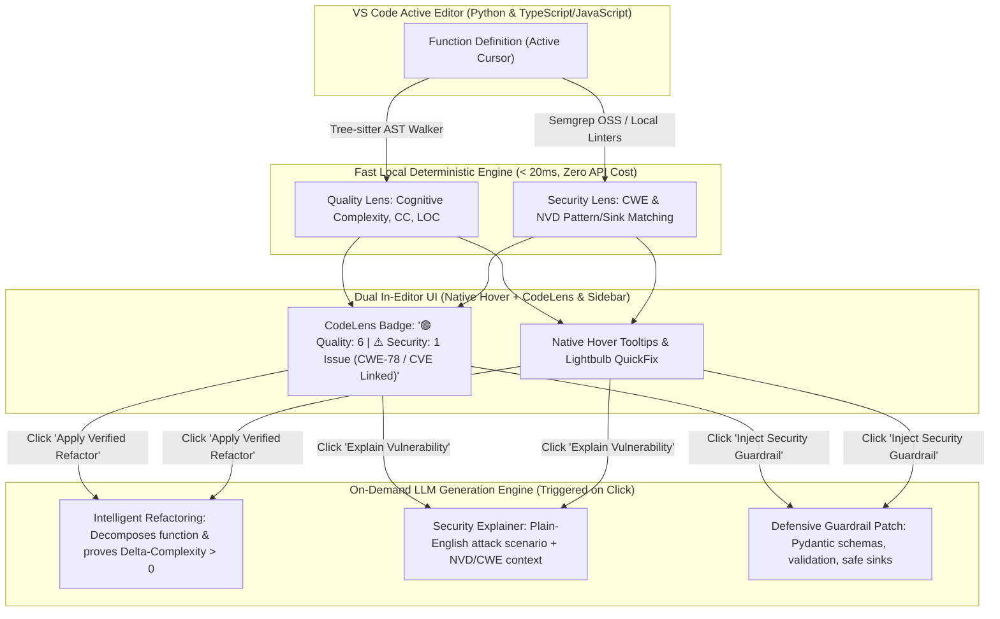
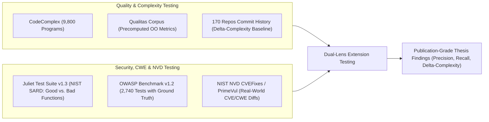
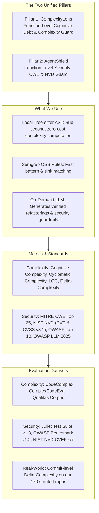

# Master Project Specification: Dual-Lens Code Quality & Security Assistant (CodeLens AI)

**Project Title:** Dual-Lens Function-Level Code Quality & Security Assistant with Automated Refactoring and Guardrail Generation  
**Students:** Ongsa, Thanadon (Peem), Brook  
**Advisor:** Prof. Kookaip  
**Target Completion:** Senior Project 2026  
**Artifacts Generated:** VS Code Extension + Core Analysis Engine + Empirical Thesis Report  

---

## 1. Executive Summary & Core Pillars

This project unites two complementary developer tools into a single, high-impact VS Code extension:
1. **Pillar 1 (ComplexityLens):** Function-Level Cognitive Debt & Complexity Guard (on-demand Cognitive Complexity, Cyclomatic Complexity, LOC, and automated refactoring with a guaranteed complexity drop).
2. **Pillar 2 (AgentShield):** Function-Level Security & Vulnerability Guard (detecting critical vulnerabilities mapped to **MITRE CWE Top 25**, **NIST NVD (CVE & CVSS v3.1)**, **OWASP Top 10**, and **OWASP Top 10 for LLMs** with 1-click defensive guardrail patches).

### Confirmed Design Choices:
1. **Scope:** **Dual-Lens Assistant** combining Code Quality/Complexity (Cognitive Complexity, Cyclomatic Complexity, LOC) and Security Flaw Detection (MITRE CWE Top 25, NIST NVD CVEs, CVSS v3.1, OWASP Top 10, OWASP LLM) in a single unified VS Code extension.
2. **Target Languages:** **Python** and **TypeScript / JavaScript** using multi-language **Tree-sitter** AST parsers (covering $>75\%$ of our 170 curated open-source repositories).
3. **Detection Engine:** **Hybrid Engine**—using local Semgrep OSS and Bandit/ESLint for rapid candidate security pattern matching, alongside Tree-sitter for sub-second complexity metrics.
4. **LLM Role (Zero API Waste):** Instant local static evaluation runs with zero latency and zero API cost. The LLM is invoked on-demand strictly for:
   - Synthesizing structural refactorings with mathematically proven $\Delta\text{Complexity}$ drops.
   - Explaining vulnerability attack vectors and generating drop-in security guardrails.
5. **Evaluation Strategy:** **Dual-Track Evaluation**:
   - *Track 1 (Standard Benchmarks):* **Juliet Test Suite v1.3** & **OWASP Benchmark v1.2** + **NIST NVD CVEFixes** (for CWE/CVE detection accuracy) and **CodeComplex / Qualitas Corpus** (for complexity metric accuracy).
   - *Track 2 (Real-World Commit-Level Evaluation):* Mining historical bug-fixing and refactoring commits across our **170 curated repositories** ([`Repos_Final_Sample.csv`](file:///d:/4th-year/Senior-Project/Repos_Final_Sample.csv)) to measure human $\Delta\text{Complexity}$ vs. our tool's automated $\Delta\text{Complexity}$ reduction.
6. **UI/UX Strategy:** Support both **Native Hovers/QuickFixes** and **CodeLens + Rich Side Panel Webview**, allowing side-by-side testing during development.

---

## 2. Core Functional Pillars

### Pillar 1: ComplexityLens (Quality & Cognitive Debt)
* **Live Function Metrics:**
  * **Cognitive Complexity:** Based on G. Ann Campbell's formal specification (penalizes nested loops, nested conditionals, recursion, and compound boolean operators).
  * **Cyclomatic Complexity (CC):** McCabe's classical decision path count ($CC = E - N + 2P$).
  * **SLOC & Nesting Depth:** Flags long parameter lists ($>4$ params) and deep indentation ($>3$ levels).
* **Guaranteed $\Delta\text{Complexity}$ Refactoring:**
  * When a function exceeds Cognitive Complexity thresholds ($>15$), the developer clicks **"Refactor Function"**.
  * The tool generates an AST-verified structural decomposition (Extract Method, Guard Clauses, Flattening).
  * The tool re-evaluates the candidate patch and proves mathematically to the developer:
    $$\Delta \text{Complexity} = \text{Cognitive}_{\text{before}} - \text{Cognitive}_{\text{after}} > 0$$
  * Verifies syntax validity and executes local tests (`pytest` / `jest`) before applying.

---

### Pillar 2: AgentShield (Security, CWE & NVD Guard)

#### A. Target Vulnerabilities (MITRE CWE Top 25 & OWASP Top 10)
* **CWE-78 / CWE-77:** OS Command Injection (untrusted strings flowing into `subprocess.run`, `os.system`, `exec`).
* **CWE-89:** SQL Injection (string concatenation in database queries).
* **CWE-79:** Cross-Site Scripting (XSS in web/desktop agent views).
* **CWE-20:** Improper Input Validation (unvalidated external parameters passing into internal logic).
* **CWE-22:** Path Traversal (directory climbing via `../`).
* **CWE-862:** Missing Authorization (autonomous actions/tools executing sensitive operations without access checks).
* **CWE-200:** Information Exposure (hardcoded secrets, API tokens, leaking prompt contexts).
* **CWE-918:** Server-Side Request Forgery (SSRF via unvalidated URL fetchers).
* **CWE-502:** Deserialization of Untrusted Data (`pickle.loads()`).
* **CWE-94:** Code Injection (use of dynamic `eval()`).
* **OWASP Top 10 for LLMs:** Prompt injection in tool parameters, insecure output handling, excessive agency.

#### B. NIST NVD (National Vulnerability Database) Integration
* **CVE to CWE Mapping:** Every detected CWE is mapped to corresponding real-world CVE case studies from the NVD data feed, showing developers concrete historical precedents of the vulnerability.
* **CVSS v3.1 Severity Scoring:** The extension displays official CVSS metrics:
  * **Base Score ($0.0 - 10.0$):** Clear severity rating (Critical: $9.0 - 10.0$, High: $7.0 - 8.9$, Medium: $4.0 - 6.9$, Low: $0.1 - 3.9$).
  * **Vector String Breakdown:** Displays Attack Vector (Network, Local), Attack Complexity (Low, High), and Privileges Required.
* **NVD Reference Links:** In-editor diagnostic hover includes direct clickable URLs to official NVD advisory pages (`https://nvd.nist.gov/vuln/detail/CVE-...`).
* **CPE Dependency Cross-Referencing:** Validates third-party packages imported by the function against NVD's Common Platform Enumeration (CPE) to flag known vulnerable library versions.

#### C. Automated Guardrail Generation
* Generates drop-in defensive code: schema validation (Pydantic / Zod), parameterized execution arrays, regex input validation, and authorization check wrappers.

---

## 3. Formal Research Questions (RQs) for Thesis Defense

* **RQ1 (Complexity Reduction & Metric Fidelity):**  
  * *How accurately does our localized Tree-sitter AST parser compute Cognitive and Cyclomatic Complexity compared to server-side enterprise analyzers (SonarQube, Radon)?*  
  * *What magnitude of complexity reduction ($\Delta\text{Complexity}$) is achieved by our automated refactoring recommendations on real-world high-complexity functions?*
* **RQ2 (Security Vulnerability Detection, NVD/CWE Mapping & Patch Safety):**  
  * *How accurately does AgentShield detect critical CWE/CVE vulnerabilities across standard security benchmark suites (Juliet Suite v1.3, OWASP Benchmark v1.2, NVD CVEFixes) compared to baseline linters (Bandit, ESLint Security)?*  
  * *What percentage of LLM-generated security guardrail patches successfully neutralize the targeted CWE without breaking functional unit tests?*
* **RQ3 (Real-World Commit-Level Evaluation across 170 Repositories):**  
  * *How does the complexity delta ($\Delta\text{Complexity}$) achieved by our tool's automated refactorings compare to human maintainers' historical refactoring and bug-fixing commits across the 170 curated open-source repositories?*  
  * *Can our tool uncover real, unpatched CWE vulnerabilities in active open-source agentic repositories that traditional linters overlooked?*

---

## 4. Benchmark Datasets & Testing Pipeline

1. **Juliet Suite v1.3, OWASP Benchmark & NVD CVEFixes Testing:**
   * Run baseline Bandit/ESLint on the benchmark test cases.
   * Run AgentShield on the same test cases.
   * Measure detection Recall and Precision across CWE-78, CWE-89, CWE-20, CWE-22, and CWE-862, cross-referencing against NVD CVE vulnerability records.
2. **Commit-Level $\Delta\text{Complexity}$ Testing:**
   * Sample historical refactoring and bug-fixing commits from [`dataset_5000_commits.csv`](file:///d:/4th-year/Senior-Project/dataset_5000_commits.csv) and [`Repos_Final_Sample.csv`](file:///d:/4th-year/Senior-Project/Repos_Final_Sample.csv).
   * Compute human before-and-after complexity changes.
   * Run our tool on the pre-commit code and compare the tool's suggested refactoring against the human developer's actual commit.

---

## 5. Implementation Roadmap & Milestones

| Phase | Milestone Description | Key Technical Deliverables | Timeline |
| :---: | :--- | :--- | :---: |
| **Phase 1** | **Core AST & Rule Engines** | - Tree-sitter parsers for Python and TypeScript/JavaScript. - Local Cognitive Complexity & Cyclomatic Complexity calculators. - Semgrep OSS and Bandit/ESLint rule execution harness. | Weeks 1–3 |
| **Phase 2** | **NVD Knowledge Base & LLM Generation Layer** | - NIST NVD CVE/CVSS mapping database integration. - AST function context window extraction. - Automated refactoring prompt engine with $\Delta\text{Complexity}$ re-verification. - Security guardrail generator (schema validation, parameterization). | Weeks 4–6 |
| **Phase 3** | **Dual VS Code Interface** | - Mode 1: Native Hover providers and CodeAction QuickFixes. - Mode 2: CodeLens badges (`🟢 Quality | 🛡️ Security [CWE/NVD]`) + Rich Webview Sidebar. - Interactive split-diff preview for refactoring. | Weeks 7–9 |
| **Phase 4** | **Empirical Evaluation & Thesis Writing** | - Run Juliet, OWASP, and NVD CVEFixes benchmark evaluations (RQ1, RQ2). - Run commit-level $\Delta\text{Complexity}$ study across 170 repositories (RQ3). - Finalize senior project thesis defense presentation and report. | Weeks 10–12 |

---

## 6. TL;DR Summary: The Project at a Glance

### Executive TL;DR Bullet Points:
* **The Product:** A single, lightweight VS Code extension giving developers instant function-level telemetry on **Code Quality (Cognitive Complexity)** and **Security (CWE / NVD Flaws)** while they code.
* **The Two Pillars:**
  1. **ComplexityLens:** Computes Cognitive Complexity, Cyclomatic Complexity, and LOC in $<20\text{ ms}$. If a function is too complex, the LLM refactors it and **mathematically proves that $\Delta\text{Complexity} > 0$**.
  2. **AgentShield:** Detects security flaws mapped to **MITRE CWE Top 25**, **NIST NVD (CVE & CVSS v3.1)**, **OWASP Top 10**, and **OWASP Top 10 for LLMs**. The LLM explains the attack vector and **generates 1-click defensive guardrail patches**.
* **Why We Beat Competitors:**
  * **vs. SonarQube:** Runs on-demand at the function level inside the editor with zero server CI build delays.
  * **vs. SonarLint:** Actively synthesizes structural refactorings with a proven drop in Cognitive Complexity, rather than just showing passive squigglies.
  * **vs. Snyk / Bandit:** Detects modern AI/Agent application flaws (tool execution, prompt injection) and writes drop-in security guardrails directly into the function.
* **How the LLM Is Used:**  
  The LLM is invoked on-demand (zero background API waste) strictly to:
  1. Synthesize verified structural refactorings that reduce Cognitive Complexity.
  2. Explain vulnerability attack vectors and generate drop-in defensive guardrail code.
* **How We Test & Validate (Thesis Defense):**
  * **Complexity Accuracy:** Tested against **CodeComplex** and **Qualitas Corpus**.
  * **Security Accuracy:** Tested against **Juliet Test Suite v1.3**, **OWASP Benchmark v1.2**, and **NIST NVD CVEFixes**.
  * **Real-World Impact:** Evaluated on historical commits from our **170 curated open-source repositories** ([`Repos_Final_Sample.csv`](file:///d:/4th-year/Senior-Project/Repos_Final_Sample.csv)) to measure human $\Delta\text{Complexity}$ vs. our tool's automated $\Delta\text{Complexity}$ reduction.
