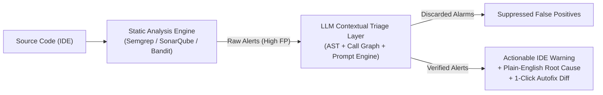
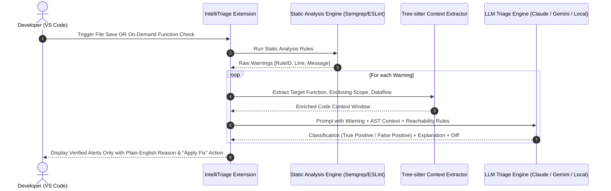

# Project Proposal 1: LLM-Augmented Static Analysis Triage & False-Positive Elimination (IntelliTriage)

**Prepared for:** Senior Project Research Proposal & Advisor Meeting (Prof. Kookaip)  
**Track:** Software Engineering / Tool Development & Applied AI  
**Core Theme:** Reducing Alert Fatigue in Static Analysis Tools (SAST/Linters) using LLM Reasoning Loops  
**Origin:** Team Discussion (Thanadon's proposal based on CEUR-WS literature)

---

## 1. Executive Summary

Static Analysis Tools (e.g., SonarQube, Semgrep, ESLint, Bandit, Flake8) are fundamental to software quality and security assurance. However, they suffer from notoriously high **False Positive (FP) rates** (often 30%–70%) and generate cryptic, generic diagnostic messages. This causes severe **alert fatigue**, leading developers to ignore warnings or disable analysis rules entirely.

**IntelliTriage** is a developer-centric tool (VS Code Extension + Backend Triage Engine) that sits between static analysis engines and the developer. Instead of overwhelming developers with raw static warnings, it uses an LLM verification layer to:
1. **Filter Out False Positives:** Scrutinize the AST context, variable reachability, and upstream sanitization to discard non-issues.
2. **Translate Cryptic Diagnostics:** Convert static linter messages into clear, context-aware explanations describing the actual risk in the developer's specific code.
3. **Synthesize Verified Autofixes:** Generate minimal, syntax-verified diffs that resolve the warning without breaking surrounding logic.

---

## 2. Problem Statement & Research Gap

### 2.1 The Industry & Academic Pain Point
* **Alert Fatigue & Rule Abandonment:** Studies show that when developers encounter more than 30% false alarms, they lose trust in the tool. Maintainers routinely suppress rules or add `// NOSONAR` / `# noqa` comments rather than fixing the underlying issues.
* **Context Blindness in Rule-Based Linters:** Traditional static engines operate on local ASTs or lexical patterns. They struggle with inter-procedural reasoning (e.g., failing to see that an untrusted input was already validated by a middleware or framework validator in another file).
* **Vague Diagnostic Messages:** Linters report *what* rule was violated (e.g., `S2095: Resources should be closed`), but fail to explain *why* it matters in this specific branch or *how* to safely fix it without introducing regressions.

### 2.2 Why Existing Tools Are Insufficient
* **SonarLint / Standalone Linters:** Merely display static rule violations without contextual verification; they have no ability to reason about runtime intent.
* **Generic Copilot / ChatGPT Prompts:** Asking a general chatbot "Is this warning real?" lacks deterministic static grounding, frequently hallucinates explanations, and cannot be integrated smoothly into a repeatable CI or IDE workflow.

---

## 3. Proposed System Architecture & Workflow

### Core Pipeline Components:
1. **Static Analysis Harness:** Wraps fast, industrial rule engines (e.g., Semgrep OSS, Flake8, ESLint, Bandit) to generate candidate issues quickly.
2. **Context Enrichment Engine:** Uses **Tree-sitter** to extract the enclosing function, callers/callees, type annotations, and local variable assignments instead of passing entire files.
3. **LLM Verification Prompt Pipeline:**
   - **Triage Prompt:** Evaluates whether the preconditions of the static warning are genuinely met in execution flow.
   - **Explanation Prompt:** Explains the impact in 2–3 concise sentences tailored to the developer's domain.
   - **Repair Prompt:** Generates the exact diff required to resolve the warning.
4. **VS Code Presentation Layer:** In-editor diagnostics gutter icons, hover tooltips, and "Quick Fix" code action buttons.

---

## 4. Formal Research Questions (RQs) for Senior Thesis

* **RQ1 (False Positive Reduction Efficiency):** *To what extent does the LLM triage layer reduce false positive rates across standard benchmark suites compared to baseline static analysis tools?*
  * *Metric:* Precision, Recall, F1-score, False Positive Reduction Rate ($\text{FPRR} = \frac{\text{FP}_{\text{baseline}} - \text{FP}_{\text{triage}}}{\text{FP}_{\text{baseline}}}$).
* **RQ2 (Correctness & Safety of Automated Repairs):** *What percentage of LLM-generated fixes resolve the static warning while maintaining syntactic validity and passing unit tests?*
  * *Metric:* Compilation rate, Test suite pass rate (Pass@1), Warning elimination rate.
* **RQ3 (Developer Perception & Remediation Efficiency):** *Does IntelliTriage reduce developer time-to-remediate warnings and increase perceived warning usefulness compared to standard IDE linters?*
  * *Metric:* Task completion time (minutes), System Usability Scale (SUS), Likert-scale diagnostic clarity rating.

---

## 5. Evaluation & Verification Methodology

1. **Phase 1: Benchmark Dataset Validation (Objective Ground Truth)**
   * Run the tool on established ground-truth datasets where warnings are pre-labeled as True Positive or False Positive:
     * **OWASP Benchmark** (for security & CWE warnings).
     * **Juliet Test Suite for C/C++ or Java / Python**.
     * Real-world open-source repositories with manually verified bug/fix datasets.
   * Compare baseline tool output against IntelliTriage output to calculate precision and false-positive reduction.

2. **Phase 2: Automated Fix Verification**
   * Run automated test suites before and after applying the LLM-recommended diffs across 100+ verified warnings to prove no behavioral regressions were introduced.

3. **Phase 3: Controlled Developer User Study**
   * Recruit 12–20 undergraduate students / developers.
   * Task: Review and fix 10 code warnings using (Group A) standard SonarLint/ESLint vs. (Group B) IntelliTriage.
   * Measure time taken per fix and collect subjective feedback via SUS survey.

---

## 6. Connection to Previous Senior Project Work

* **Repurposing Codebase Assets:** You have already analyzed 170 real-world repositories ([`Repos_Final_Sample.csv`](file:///d:/4th-year/Senior-Project/Repos_Final_Sample.csv)) and 5,000 commits ([`dataset_5000_commits.csv`](file:///d:/4th-year/Senior-Project/dataset_5000_commits.csv)).
* **Evaluation Target:** You can run IntelliTriage directly across your 170 curated open-source repositories to analyze real warnings in active agentic/software systems.
* **Complexity Metrics Reuse:** When evaluating generated fixes, you can compute $\Delta \text{Complexity}$ (Cyclomatic Complexity, Cognitive Complexity from [`Data fields.txt`](file:///d:/4th-year/Senior-Project/Data%20fields.txt)) to verify that fixing a warning did not make the code more convoluted.

---

## 7. Recommended Technology Stack

| Layer | Recommended Technology | Rationale |
| :--- | :--- | :--- |
| **IDE Interface** | VS Code Extension API (TypeScript) | Native diagnostics provider, CodeActionProvider, hover tooltips. |
| **Static Analysis Engine** | **Semgrep OSS** / **ESLint** / **Bandit** | Fast, rule-based, extensible JSON output, support for Python/TypeScript. |
| **AST & Context Extraction** | **Tree-sitter** (via web-tree-sitter or Python bindings) | Blazing fast AST node querying and boundary extraction. |
| **Triage & Remediation Model** | OpenAI GPT-4o-mini / Anthropic Claude 3.5 Sonnet / Local Ollama (DeepSeek-Coder) | High reasoning precision, low latency, cost-effective. |
| **Benchmark Datasets** | OWASP Benchmark, Juliet Test Suite, Selected repos from `Repos_Final_Sample.csv` | Peer-accepted academic benchmarks. |

---

## 8. Advisor Pitching Strategy & FAQ

### Key Pitch to Prof. Kookaip (Thai summary):
> *"เครื่องมือนี้แก้ปัญหาใหญ่ของ Static Analysis คือ False Positive ที่เยอะเกินไปจน developer รำคาญและปิดทิ้ง (Alert Fatigue) โดยเราสร้าง Extension ที่นำ Static Linter มารวมกับ LLM ที่คอยเช็คบริบทเฉพาะจุด (AST context) เพื่อคัดกรอง False Positive ทิ้ง อธิบายเตือนด้วยภาษาที่เข้าใจง่าย และเสนอ 1-Click Autofix ที่ผ่านการ verify แล้ว โครงการนี้มี Benchmark ชัดเจน (วัด Precision, Recall, อัตราการลด False Positive) และทำ User Study ทดสอบกับ developer ได้จริง"*

### Potential Advisor Questions & Strong Answers:
* **Advisor:** *"Is this just a wrapper around ChatGPT?"*
  * **Answer:** *"No. The static analysis engine provides deterministic ground truth and pinpoint line locations. The LLM is strictly constrained as a contextual classifier and patch generator guided by AST boundaries and reachability schemas, evaluated against formal benchmarks (Juliet/OWASP)."*
* **Advisor:** *"What if the LLM hallucinated an invalid fix?"*
  * **Answer:** *"The tool runs a local syntax and AST validation pass on the generated diff before displaying it to the user. If the diff fails syntax validation or re-triggers the static rule, it is discarded."*
