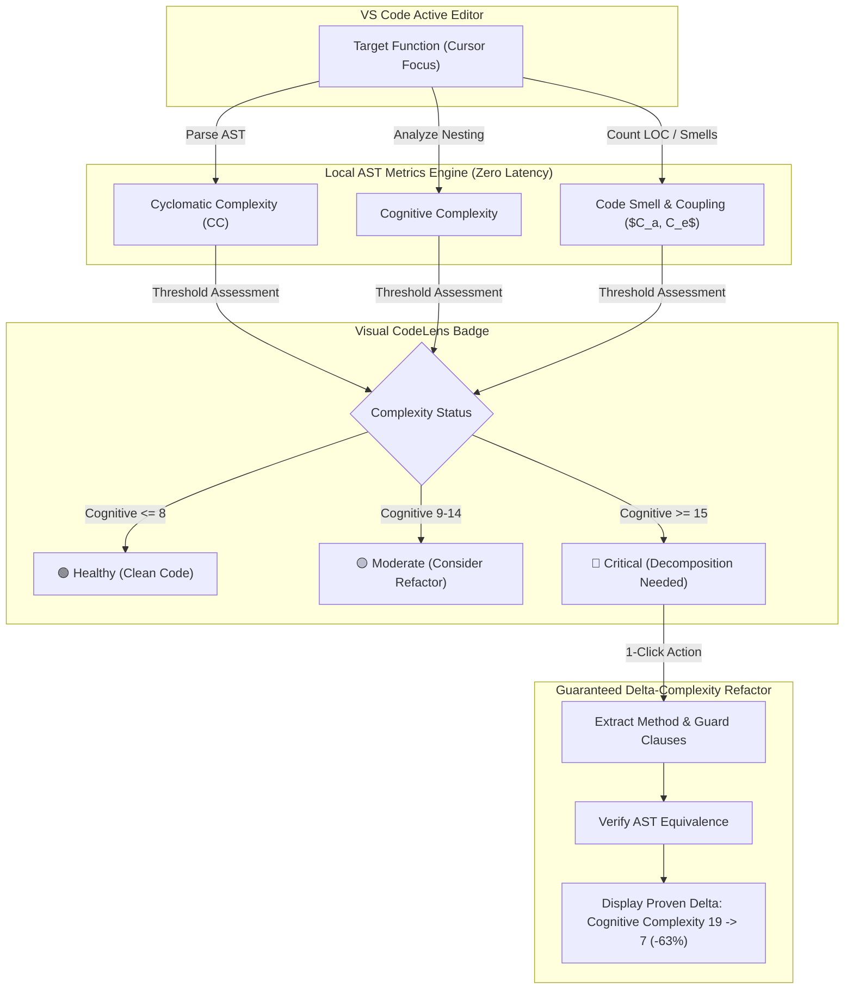
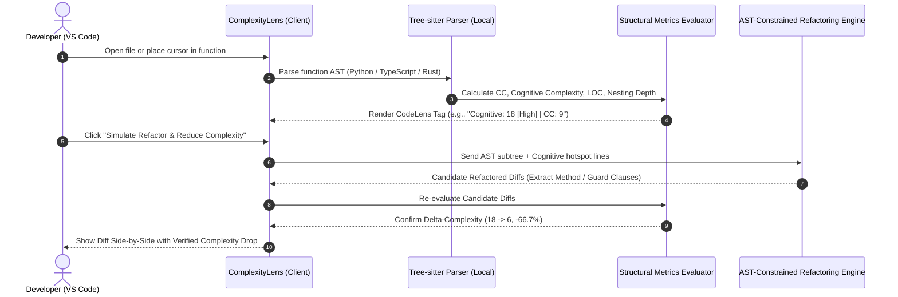

# Project Proposal 2: Function-Level Cognitive Debt & Complexity Guard (ComplexityLens)

**Prepared for:** Senior Project Research Proposal & Advisor Meeting (Prof. Kookaip)  
**Track:** Software Engineering / Software Metrics & Refactoring Assistance  
**Core Theme:** On-Demand Function-Level Code Quality Assessment & Verified Cognitive Debt Reduction  
**Origin:** Team Discussion (Ongsa's proposal for granular, on-demand function evaluation)

---

## 1. Executive Summary

As developers increasingly rely on AI coding assistants (Copilot, Cursor, Claude Code), code generation speed has dramatically increased, but so has **hidden cognitive complexity** and **architectural bloat**. AI tools frequently generate syntactically working diffs that feature excessive indentation nesting, bloated parameter lists, and duplicated conditional branches—turning simple functions into unmaintainable "God functions."

Existing tools like SonarQube operate primarily as heavyweight, full-project CI scans that disrupt active coding flow. Developers lack immediate, fine-grained feedback on the specific function they are currently editing.

**ComplexityLens** is an interactive VS Code extension that enables developers to evaluate code quality **on demand at the function or block level**. It provides:
1. **Instant Function-Level Complexity Gauges:** Real-time calculation of Cyclomatic Complexity (CC), Cognitive Complexity, Lines of Code (LOC), and Code Smell Density right in the editor gutter/lens.
2. **Interactive Architectural Decomposition:** For complex functions (e.g., Cognitive Complexity $> 15$), the tool recommends optimal decomposition points (Extract Method, Flatten Conditionals, Guard Clauses).
3. **Mathematically Proven $\Delta \text{Complexity}$ Guarantee:** Proves that the recommended refactoring reduces the function's Cognitive Complexity by a quantifiable delta ($\Delta \text{Complexity} = \text{Complexity}_{\text{before}} - \text{Complexity}_{\text{after}}$) without altering execution semantics.

---

## 2. Problem Statement & Research Gap

### 2.1 The Industry & Academic Pain Point
* **The "AI Bloat" Dilemma:** Recent empirical studies show that while AI assistance increases code velocity, it leads to code churn and higher cyclomatic complexity over time because developers accept sprawling functions without refactoring.
* **Full-Project Scan Latency:** Tools like SonarQube, CodeClimate, or SonarCloud require full-project indexing or CI/CD pipelines. They give feedback minutes or hours after the code is written, when the developer's mental context has already shifted.
* **Lack of Granular, Interactive Control:** Developers want to evaluate only the function they are touching, without having to review hundreds of legacy warnings across the entire repository.

### 2.2 Why Existing Tools Are Insufficient
* **SonarLint:** Provides static issue squigglies, but lacks intuitive visual function-level complexity telemetry and does not offer guided, step-by-step structural decomposition with mathematical proof of complexity reduction.
* **Cursor / Copilot Chat:** General LLM prompts ("Refactor this function") often hallucinate, change variable scopes unexpectedly, or produce code that is equally or more complex than the original.

---

## 3. Proposed System Architecture & Core Features

### Key Technical Innovations:
1. **Zero-Latency In-Editor Telemetry:** Implements localized AST traversal (via Tree-sitter) calculating Cognitive Complexity directly inside the editor in $< 50\text{ ms}$.
2. **Cognitive Hotspot Highlighting:** Highlights specific lines contributing to cognitive strain (e.g., deeply nested `for` loops, tertiary conditionals, break/continue jumps).
3. **Verified Complexity Drop ($\Delta \text{Complexity}$):** Every suggested refactor must mathematically pass the condition:
   $$\text{Cognitive Complexity}_{\text{after}} < \text{Cognitive Complexity}_{\text{before}}$$
   and must pass existing unit tests.

---

## 4. Formal Research Questions (RQs) for Senior Thesis

* **RQ1 (Measurement Accuracy & Correlation):** *How accurately and consistently does the localized function-level AST parser calculate Cognitive and Cyclomatic Complexity compared to standard server-grade analyzers (SonarQube, Radon)?*
  * *Metric:* Pearson/Spearman correlation coefficient ($r \ge 0.95$), calculation latency (ms).
* **RQ2 (Complexity Reduction Efficacy):** *What magnitude of complexity reduction ($\Delta \text{Cognitive Complexity}, \Delta \text{LOC}$) is achieved by the tool's automated refactoring recommendations on complex functions?*
  * *Metric:* Percentage reduction in Cognitive Complexity ($\% \Delta \text{CC}$), Halstead volume reduction.
* **RQ3 (Developer Usability & Refactoring Willingness):** *Does real-time, on-demand function telemetry increase developers' willingness to refactor high-debt functions compared to post-hoc CI quality reports?*
  * *Metric:* Refactoring frequency during coding sessions, System Usability Scale (SUS), cognitive load assessment (NASA-TLX).

---

## 5. Evaluation & Verification Methodology

1. **Phase 1: Metric Fidelity & Benchmark Verification**
   * Run the AST complexity parser across 1,000 functions sampled from the repository's curated dataset ([`Repos_Final_Sample.csv`](file:///d:/4th-year/Senior-Project/Repos_Final_Sample.csv)).
   * Compare computed scores against SonarQube's official Cognitive Complexity plugin to prove 100% compliance with G. Ann Campbell's formal Cognitive Complexity specification.

2. **Phase 2: Automated Refactoring Validation**
   * Identify all functions with Cognitive Complexity $\ge 15$ in the benchmark sample.
   * Run ComplexityLens's refactoring engine across these functions.
   * Verify semantic preservation using automated test suites and calculate mean complexity reduction ($\Delta \text{Complexity}$).

3. **Phase 3: Controlled Developer Experiment**
   * 16–20 developer participants given tasks to implement a feature or fix a bug in a complex legacy codebase.
   * Group A (Baseline): Standard IDE with SonarLint.
   * Group B (Experimental): IDE with ComplexityLens CodeLens & On-Demand Refactoring.
   * Measure code quality of the submitted patches (final complexity, test coverage) and developer satisfaction.

---

## 6. Connection to Previous Senior Project Work

* **Direct Reuse of Formal Definitions:** You have already documented the exact mathematical criteria for Cyclomatic Complexity, Cognitive Complexity, Lines of Code, and Couplings in [`Data fields.txt`](file:///d:/4th-year/Senior-Project/Data%20fields.txt).
* **Target Repositories as Testbed:** The 170 repositories in [`Repos_Final_Sample.csv`](file:///d:/4th-year/Senior-Project/Repos_Final_Sample.csv) provide tens of thousands of real-world Python and TypeScript functions to benchmark your metric calculations.
* **Groundwork on Complexity Studies:** Your prior research plan on $\Delta \text{Complexity}$ before and after commits can now be directly built into the tool as its core feature!

---

## 7. Recommended Technology Stack

| Component | Technology | Rationale |
| :--- | :--- | :--- |
| **Editor Integration** | VS Code Extension API (`languages.registerCodeLensProvider`, `HoverProvider`) | Native, lightweight in-editor display. |
| **AST Parser** | **Tree-sitter** (`tree-sitter-python`, `tree-sitter-typescript`) | Extremely fast, incremental parsing; handles incomplete or dirty code during typing. |
| **Metric Implementations** | Local TypeScript / Python AST walker | Implements SonarSource's official Cognitive Complexity whitepaper specification. |
| **Refactoring Engine** | Claude 3.5 Sonnet / GPT-4o-mini with structured output | Formats refactoring into precise AST replacements. |
| **Validation Runner** | `pytest` / `jest` execution subprocess | Validates semantic equivalence before suggesting patches to the developer. |

---

## 8. Advisor Pitching Strategy & FAQ

### Key Pitch to Prof. Kookaip (Thai summary):
> *"เครื่องมือนี้เน้นช่วย developer จัดการ Cognitive Debt (หนี้ทางความคิด) ในระดับ Function โดยตรง เพราะปัจจุบันเวลาคนใช้ AI อย่าง Copilot หรือ Cursor โค้ดจะงอกเร็วมาก แต่มักจะได้ฟังก์ชันที่ซ้อน if หลายชั้นและบวมยาว (God Function) เครื่องมือของเราจะแสดงป้าย Complexity Gauge เหนือฟังก์ชันทันทีขณะพิมพ์โค้ด (ไม่ต้องรอรัน CI แบบ SonarQube) และเมื่อฟังก์ชันเริ่มซับซ้อนเกินเกณฑ์ จะมีปุ่มจำลองการ Refactor ที่รับประกันว่าค่า Cognitive Complexity จะลดลงจริงตามสูตรคณิตศาสตร์ โดยไม่ทำให้ระบบพัง"*

### Potential Advisor Questions & Strong Answers:
* **Advisor:** *"Doesn't SonarLint already calculate Cognitive Complexity?"*
  * **Answer:** *"SonarLint flags a warning only after a threshold is breached, but it does not provide live, continuous telemetry, nor does it offer automated, multi-step structural decomposition with a verifiable delta-complexity drop guarantee."*
* **Advisor:** *"How do you prove that the refactoring didn't change the function's behavior?"*
  * **Answer:** *"The tool leverages existing unit test execution and AST mutation checks prior to presenting the candidate diff to the developer, ensuring semantic preservation."*
