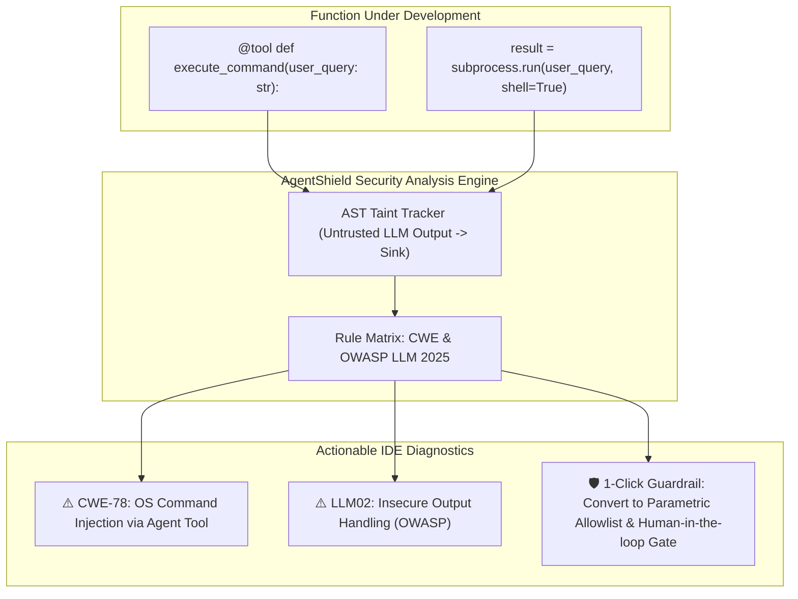
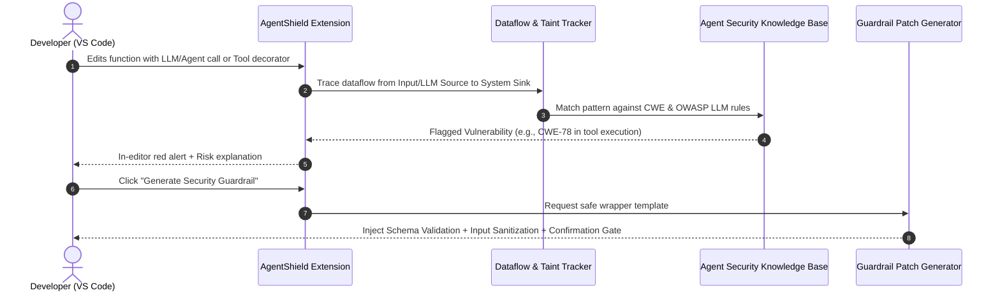

# Project Proposal 3: Function-Level CWE & Security Guard for Agentic & LLM Applications (AgentShield)

**Prepared for:** Senior Project Research Proposal & Advisor Meeting (Prof. Kookaip)  
**Track:** Software Security / Static Application Security Testing (SAST) for AI Systems  
**Core Theme:** Detecting CWEs and OWASP Top 10 for LLMs at the Function & Tool Interface Level  
**Origin:** Team Discussion (Ongsa's proposal for function-level CWE vulnerability detection)

---

## 1. Executive Summary

As open-source software rapidly integrates LLMs and autonomous agents (e.g., LangChain, Model Context Protocol (MCP), tool-calling loops), a dangerous new class of security vulnerabilities has emerged. Traditional SAST tools (SonarQube, Bandit, Snyk) are built for classical web/database stacks; they are largely blind to **AI-specific architectural vulnerabilities** such as **Prompt Injection passing untrusted strings into system tools**, **unrestricted autonomous tool execution**, and **uncontrolled memory/context leakage**.

**AgentShield** is an in-IDE security extension (VS Code) that performs specialized, function-level security analysis on code that interfaces with LLMs, autonomous agents, and external tools. It scans functions for:
1. **Critical CWEs in AI Workflows:** Mapping dangerous code patterns to standardized Common Weakness Enumeration categories (e.g., CWE-20, CWE-78, CWE-862, CWE-200, CWE-918).
2. **OWASP Top 10 for LLMs Compliance:** Identifying Prompt Injection propagation, Insecure Output Handling, Excessive Agency, and Sensitive Information Disclosure in function arguments.
3. **Automated Guardrail Generation:** Recommending and injecting concrete security guardrails (input sanitization schemas, permission enforcers, human-in-the-loop confirmation gates) directly into the vulnerable function.

---

## 2. Problem Statement & Research Gap

### 2.1 The Industry & Academic Pain Point
* **The Rapid Rise of Agentic AI Vulnerabilities:** In your repository analysis of 170 agentic systems ([`Repos_Final_Sample.csv`](file:///d:/4th-year/Senior-Project/Repos_Final_Sample.csv)), hundreds of tools grant autonomous agents the power to execute shell commands, edit files, and scrape internal URLs.
* **The Blind Spot of Traditional SAST:**
  * Conventional linters check for hardcoded passwords or SQL string concatenation.
  * They do **not** know what an "LLM tool call" is, cannot detect when an unvalidated LLM output flows into a shell command, and cannot identify missing authorization barriers in autonomous loops.
* **Developer Neglect:** Developers prototyping AI agents rarely implement sandboxing or input validation, creating severe security exploits in real-world agent deployments.

### 2.2 Relevant CWE & OWASP Mappings

| Category | Standard CWE | OWASP LLM Top 10 | Real-World Agent Vulnerability |
| :--- | :---: | :---: | :--- |
| **Command Injection via Tool** | **CWE-78** | **LLM02: Insecure Output Handling** | Agent receives LLM string and directly calls `subprocess.run(shell=True)`. |
| **Improper Input Sanitization** | **CWE-20** | **LLM01: Prompt Injection** | Unsanitized external web content or email fed directly into system prompt. |
| **Excessive Agency / Missing Auth** | **CWE-862** | **LLM06: Excessive Agency** | Agent tool performs irreversible write operations (e.g. `delete_db()`) without human confirmation. |
| **Memory / Secret Exposure** | **CWE-200** | **LLM07: System Information Leak** | Agent stores raw environment keys or private user prompts in unencrypted vector memory. |
| **Server-Side Request Forgery** | **CWE-918** | **LLM02: Insecure Output Handling** | Autonomous browser/scraper fetches internal localhost addresses (`http://169.254.169.254`). |

---

## 3. Proposed System Architecture & Core Features

### Key Technical Capabilities:
1. **AI-Aware Function Decorator Detection:** Recognizes `@tool`, `@action`, MCP server schemas, and LLM call sites (`openai.chat.completions`, `anthropic.messages`).
2. **Source-to-Sink Taint Tracking:** Traces variables originating from untrusted sources (user chat, external API, web scrape) into dangerous execution sinks (`eval`, `exec`, `os.system`, `fetch`).
3. **Automated Guardrail Injection:** Generates drop-in defensive patterns (Pydantic schemas, regex validation, approval callbacks).

---

## 4. Formal Research Questions (RQs) for Senior Thesis

* **RQ1 (Detection Efficacy & Accuracy):** *How accurately can AgentShield detect CWE vulnerabilities and OWASP LLM anti-patterns in agentic codebases compared to generic SAST tools (Bandit, Semgrep OSS)?*
  * *Metric:* Precision, Recall, F1-score across a ground-truth benchmark of vulnerable agent code.
* **RQ2 (Prevalence in Real-World Systems):** *What is the prevalence and distribution of these function-level security vulnerabilities across the 170 curated open-source agentic repositories in `Repos_Final_Sample.csv`?*
  * *Metric:* Vulnerability density (vulnerabilities per KLOC), distribution across CWE categories, tool execution risks.
* **RQ3 (Effectiveness of Automated Guardrails):** *Do the automated guardrail patches successfully mitigate the identified CWEs without breaking the functional agent workflow?*
  * *Metric:* Exploit mitigation success rate, functional test pass rate.

---

## 5. Evaluation & Verification Methodology

1. **Phase 1: Synthetic Benchmark Evaluation**
   * Construct or utilize an established benchmark of vulnerable AI agent scripts (e.g., SecTool benchmark, vulnerable LangChain/LlamaIndex apps).
   * Evaluate AgentShield's detection accuracy against generic linters (Bandit, SonarLint, Semgrep).

2. **Phase 2: Empirical Mining of the 170 Agentic Repositories (Huge Research Advantage!)**
   * Run AgentShield across the 170 curated repositories in [`Repos_Final_Sample.csv`](file:///d:/4th-year/Senior-Project/Repos_Final_Sample.csv).
   * Document real-world findings: How many popular agent repositories have unauthenticated tool execution or prompt injection risks? This provides instant publication-grade empirical data for your thesis report!

3. **Phase 3: Remediation Validation**
   * Apply AgentShield's automated guardrails to detected vulnerable functions and execute simulated injection attacks to prove the exploit is blocked.

---

## 6. Connection to Previous Senior Project Work

* **Immediate Empirical Goldmine:** You have already collected and curated 170 active agentic repositories ([`Repos_Final_Sample.csv`](file:///d:/4th-year/Senior-Project/Repos_Final_Sample.csv)) and downloaded their documentation and structures. Running AgentShield on this exact dataset gives you an immediate empirical paper chapter!
* **Topic Modeling Insights:** Your BERTopic analysis ([`Topic_Modelling_Summary.md`](file:///d:/4th-year/Senior-Project/topic_modelling/Topic_Modelling_Summary.md)) showed that **Topic 13 (Cybersecurity)** and **Topic 4 (Authentication & Credentials)** are among the most heavily discussed topics in agent documentation. Your tool addresses the exact gaps documented in the ecosystem.

---

## 7. Recommended Technology Stack

| Component | Technology | Rationale |
| :--- | :--- | :--- |
| **IDE Interface** | VS Code Extension (TypeScript) | Diagnostic collection, gutter security badges, CodeActions. |
| **Analysis Rules Engine** | **Semgrep Rules Engine** + **Tree-sitter** | Highly customizable YAML-based rules for tracing function parameters to sinks. |
| **Security Knowledge Base** | **OWASP Top 10 for LLMs (2025)** & **MITRE CWE** | Industry-standard taxonomy for academic credibility. |
| **Guardrail Generator** | Local Rule Templates + LLM (Claude 3.5 Sonnet / GPT-4o-mini) | Fills standardized defensive wrappers and input validation schemas. |
| **Benchmark Suite** | Curated vulnerable AI agent apps + `Repos_Final_Sample.csv` | Empirical ground truth. |

---

## 8. Advisor Pitching Strategy & FAQ

### Key Pitch to Prof. Kookaip (Thai summary):
> *"เครื่องมือนี้โฟกัสไปที่ปัญหาความปลอดภัย (Security & CWE) ในซอฟต์แวร์ยุคใหม่ที่ต่อเข้ากับ AI และ Autonomous Agents เช่น ระบบที่มีการให้ LLM เรียกใช้ tool หรือรัน bash command ซึ่งเครื่องมือ SAST ทั่วไปอย่าง SonarQube หรือ Bandit ตรวจจับไม่ได้ เพราะไม่เข้าใจบริบทของ AI Agent เครื่องมือเราจะทำหน้าที่ตรวจจับ CWE เช่น Command Injection (CWE-78) หรือ Missing Authorization (CWE-862) ที่ระดับฟังก์ชัน และที่สำคัญคือ **เราสามารถนำเครื่องมือนี้ไปสแกน 170 Agent Repositories ที่เราคัดเลือกไว้แล้ว เพื่อทำเป็นรายงานวิจัยเชิงประจักษ์ (Empirical Study) ประกอบตัว Tool ได้ทันที**"*

### Potential Advisor Questions & Strong Answers:
* **Advisor:** *"Why not just use Semgrep or Snyk?"*
  * **Answer:** *"Standard Semgrep and Snyk rule registries focus on web backends (SQL injection, XSS) and package vulnerabilities. They completely lack rules for LLM tool invocation, prompt propagation, and autonomous agent loops. AgentShield bridges this specific gap."*
* **Advisor:** *"Is the dataset ready for evaluation?"*
  * **Answer:** *"Yes! We already have 170 curated open-source agentic repositories with verified activity in `Repos_Final_Sample.csv`, giving us an immediate, peer-reviewable testbed."*
