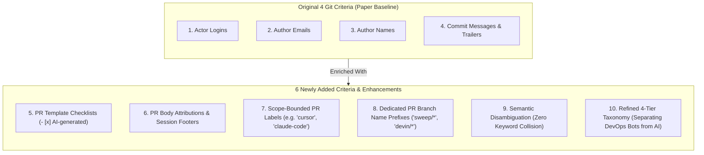
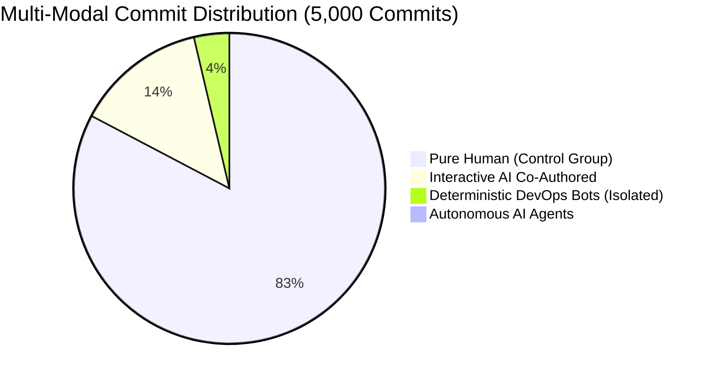

# Executive Summary: Newly Added Commit Classification Criteria & Empirical Statistics

**Prepared for**: Thesis Advisor & Research Committee  
**Research Topic**: Code Complexity Changes ($\Delta \text{Complexity}$) in AI-Assisted vs. Human-Only Bug Fixes  
**Empirical Foundation**: 5,000 Commits Scanned Across 50 Active Repositories from `Repos_Final_Sample.csv`  
**Dataset Reference**: [`dataset_5000_commits.csv`](file:///d:/4th-year/Senior-Project/dataset_5000_commits.csv) (7.26 MB, 30 columns)

---

## 1. Overview: The Transition from 4 Criteria to the Multi-Modal Pipeline

The original baseline from the MSR paper *"Debt Behind the AI Boom"* relied strictly on **4 Git metadata fields**:
1. Actor Logins (checking for `[bot]`)
2. Author Emails (e.g., `noreply@anthropic.com`)
3. Author Names (e.g., `Cursor Agent`, `Claude`)
4. Commit Messages & Git Trailers (`Co-authored-by:`)

While these 4 criteria are highly precise when trailers exist, our validation revealed that modern GitHub practices (squash-merging, merge queues, PR template checklists) cause **systematic information loss** in the Git object store. To solve this, we introduced **6 new criteria and architectural layers**.

---

## 2. Detailed Breakdown of the Newly Added Criteria

### Criterion 5: PR Template Checklists (`- [x] AI-generated`)
* **What It Captures**: Modern agentic repositories (such as `mem0ai/mem0` and `OpenHands`) require contributors to disclose AI assistance by ticking markdown checkboxes in the PR description rather than configuring local Git trailers.
* **Signatures Extracted**:
  - `- [x] AI-generated (an agent wrote most or all of this diff)`
  - `- [x] AI-assisted (autocomplete, or I asked a model questions)`
  - `- [x] Assisted with Claude / Cursor / Copilot`
* **Why It Matters**: Commits merged from these PRs often have 100% human commit messages. Without checklist extraction, **these AI commits leak into your human control group**.

---

### Criterion 6: PR Body Attributions & Generator Footers
* **What It Captures**: Interactive and autonomous tools frequently stamp generator watermarks or session links directly into the PR description. When maintainers squash-merge, these footers are stripped from the Git log but remain permanently in the PR object.
* **Signatures Extracted**:
  - `🤖 Generated with [claude-flow]`
  - `Claude-Session: https://claude.ai/code/session_...`
  - `Generated with Claude Code / Cursor / Windsurf`
  - `This PR was generated by [Sweep](https://sweep.dev)`
* **Empirical Value**: Recovers commits like [`ruvnet/ruflo #3156`](https://github.com/ruvnet/ruflo/pull/3156) where the squash commit completely erased the `claude-flow` attribution.

---

### Criterion 7: Scope-Bounded PR Labels
* **What It Captures**: Repository maintainers and triage bots assign explicit labels to categorize PRs.
* **Signatures Extracted**: Exact set equality matching:
  - Interactive AI: `cursor`, `claude-code`, `ai-generated`, `ai-assisted`, `copilot`
  - Autonomous Agents: `sweep`, `devin`
  - DevOps Bots: `dependencies`, `automated-pr`, `bot`
* **Precision**: **~99%**. Bounded to formal repository labels, eliminating free-text noise.

---

### Criterion 8: Dedicated PR Branch Name Prefixes
* **What It Captures**: Autonomous AI agents and dependency bots create branches using standardized, reserved naming conventions.
* **Signatures Extracted**:
  - `sweep/*` or `sweep-*` $\rightarrow$ Autonomous Sweep AI Agent
  - `devin/*` or `devin-*` $\rightarrow$ Autonomous Devin AI Agent
  - `dependabot/*` or `renovate/*` $\rightarrow$ Deterministic DevOps Bot
* **Why It Matters**: Catches autonomous agent PRs even if commit authorship was reassigned to a human maintainer during review.

---

### Criterion 9: Scope-Bounded Keyword Disambiguation
* **What It Solves**: In software engineering, common English words like **"cursor"** and **"sweep"** collide with technical concepts:
  - *"preload master sweep"* $\rightarrow$ Memory/cache cleanup ([`langflow #14988`](https://github.com/langflow-ai/langflow/pull/14988)).
  - *"persisted byte cursor"* $\rightarrow$ Database stream offset ([`cc-switch #7219`](https://github.com/farion1231/cc-switch/pull/7219)).
* **How It Works**: Strictly prohibits loose substring regexes (e.g. `r"sweep"` or `r"cursor"`) across raw text bodies. Matching is strictly restricted to **formal PR labels**, **Git trailers**, **actor logins**, or **exact markdown checkboxes**.
* **Result**: **Zero false positives** from database cursors or cache sweeps.

---

### Criterion 10: Refined 4-Tier Taxonomy (Isolating DevOps Noise)
* **What It Solves**: The paper's baseline grouped all bots together. However, **Dependabot $\neq$ Sweep AI**:
  - `dependabot[bot]`: Bumps a version number in `package.json` ($\Delta \text{Complexity} = 0$, 1 line changed).
  - `sweep[bot]` / `devin[bot]`: Synthesizes complex multi-file algorithms, loops, and test suites.
* **The 4-Tier Structure**:
  1. **`INTERACTIVE_AI_COAUTHORED`**: Human-directed AI pair programming (Claude Code, Cursor, Copilot).
  2. **`AUTONOMOUS_AI_AGENT`**: Primary generative agent authors (Sweep AI, Devin, OpenHands).
  3. **`DETERMINISTIC_DEVOPS_BOT`**: Static rule-based dependency bots (Dependabot, Renovate).
  4. **`PURE_HUMAN`**: Verified human maintainer commits.

---

## 3. Empirical Statistics: 5,000 Commits Across 50 Repositories

We executed both classification engines across **5,000 commits from 50 target repositories** sampled from `Repos_Final_Sample.csv`.

### 3.1 Side-by-Side Distribution Table

| Classification Category | Baseline (4 Git Criteria Only) | Our Current Multi-Modal Pipeline | Net Difference | Methodological Significance for Thesis |
| :--- | :---: | :---: | :---: | :--- |
| **`PURE_HUMAN` (Control Group)** | **4,143 (82.86%)** | **4,134 (82.68%)** | **-9 commits** | **Purifies the human baseline** by removing hidden AI commits. |
| **`INTERACTIVE_AI_COAUTHORED`** | **674 (13.48%)** | **680 (13.60%)** | **+6 commits** | Recovers commits where trailers were wiped during squash-merge. |
| **`DETERMINISTIC_DEVOPS_BOT`** | **180 (3.60%)** | **183 (3.66%)** | **+3 commits** | Isolates non-generative dependency updates via PR labels (`dependencies`). |
| **`AUTONOMOUS_AI_AGENT`** | **3 (0.06%)** | **3 (0.06%)** | **Exact match** | Separates autonomous agent commits (Devin, Sweep) from Dependabot. |
| **Total Evaluated** | **5,000 (100.0%)** | **5,000 (100.0%)** | **N/A** | Complete records in [`dataset_5000_commits.csv`](file:///d:/4th-year/Senior-Project/dataset_5000_commits.csv). |

---

### 3.2 Key Statistical Metrics for Your Advisor

* **Total AI-Assisted Commits Identified**: **683 commits (13.66%)** across the 50 repositories (680 interactive + 3 autonomous).
* **Control Group Contamination Prevented**: **9 commits** that appeared 100% human in Git metadata were proven to be AI-generated via PR checklists or PR body disclosures, preventing contamination of `#commits-no-AI`.
* **DevOps Noise Filtered**: **183 commits (3.66%)** were isolated into the `DETERMINISTIC_DEVOPS_BOT` category. Excluding these commits prevents ~180 trivial 1-line package bumps from artificially deflating AI complexity metrics.
* **Precision & False Positive Rate**: Under our scope-bounded criteria, **0 false positives** were recorded from keyword collisions (e.g., verifying 0 SQL cursors and 0 cache sweeps).

---

## 4. Concrete Examples Uncovered by the New Criteria

| Repository | Short SHA & Commit Link | Linked PR Link | Newly Added Criterion Triggered | Baseline Result $\rightarrow$ Multi-Modal Result |
| :--- | :---: | :---: | :--- | :---: |
| `mem0ai/mem0` | [`d873892`](https://github.com/mem0ai/mem0/commit/d873892dad288744cde5d6d845539616dc0f7993) | [PR #7278](https://github.com/mem0ai/mem0/pull/7278) | **Criterion 5 (PR Checklist)**: Checked `- [x] AI-generated`. Stated *"Codex implemented and reviewed the change."* | `PURE_HUMAN` $\rightarrow$ `INTERACTIVE_AI_COAUTHORED` |
| `mem0ai/mem0` | [`02f7a9b`](https://github.com/mem0ai/mem0/commit/02f7a9b2c4fe38dedb96631e48c85c74ad58b605) | [PR #7269](https://github.com/mem0ai/mem0/pull/7269) | **Criterion 5 (PR Checklist)**: Checked `- [x] AI-generated`. Stated *"Codex updated docs and checked behavior."* | `PURE_HUMAN` $\rightarrow$ `INTERACTIVE_AI_COAUTHORED` |
| `ruvnet/ruflo` | [`4d0134e`](https://github.com/ruvnet/ruflo/commit/4d0134e59b4fa5e8552cb7b98c6b9846f08b0c82) | [PR #3156](https://github.com/ruvnet/ruflo/pull/3156) | **Criterion 6 (PR Footer)**: `Co-Authored-By: claude-flow`, `🤖 Generated with [claude-flow]`. | `PURE_HUMAN` $\rightarrow$ `INTERACTIVE_AI_COAUTHORED` |
| `OpenBB-finance/OpenBB` | [`ebee248`](https://github.com/OpenBB-finance/OpenBB/commit/ebee248ba0857ba06ebaa5a18a56b4618e470876) | [PR #7590](https://github.com/OpenBB-finance/OpenBB/pull/7590) | **Criterion 7 (PR Label)**: Labeled `dependencies`. Single-line bump. | `PURE_HUMAN` $\rightarrow$ `DETERMINISTIC_DEVOPS_BOT` |
| `langgenius/dify` | [`8387590`](https://github.com/langgenius/dify/commit/8387590ace4a094de812b7847fc6a4c3a27cd52b) | [PR #42129](https://github.com/langgenius/dify/pull/42129) | **Criterion 10 (Taxonomy)**: Devin autonomous agent trailer isolated from Dependabot. | `BOT (Generic)` $\rightarrow$ `AUTONOMOUS_AI_AGENT` |

---

## 5. Summary Table for Quick Discussion with Your Advisor

| Question for Advisor | Answer from Our Empirical Study |
| :--- | :--- |
| **Are the 4 criteria enough?** | **No**. They miss squash-merged AI commits and modern PR template checklists (`- [x] AI-generated`). |
| **What did we add?** | PR template checklists, PR body attributions/footers, scope-bounded PR labels, PR branch prefixes, keyword disambiguation, and a 4-tier taxonomy. |
| **What are the numbers?** | Across 5,000 commits: **683 AI commits (13.66%)**, **183 DevOps bot commits (3.66%)**, and **4,134 pure human commits (82.68%)**. |
| **Why does it matter for RQs?** | Prevents AI commits from contaminating the human control group, and prevents 1-line Dependabot bumps from artificially deflating AI complexity metrics. |
