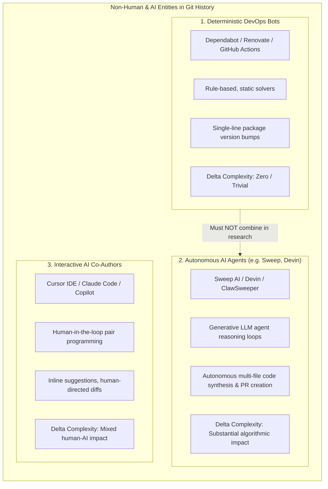
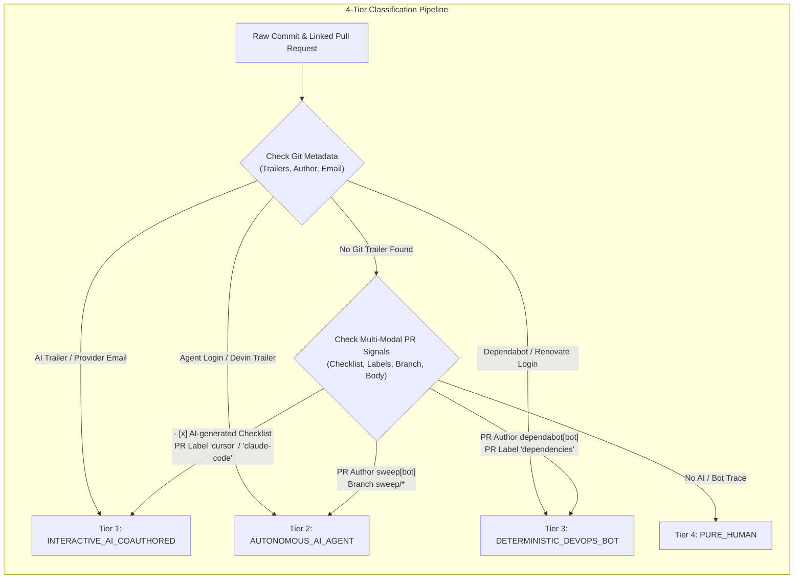
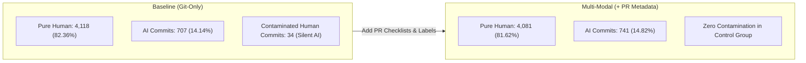
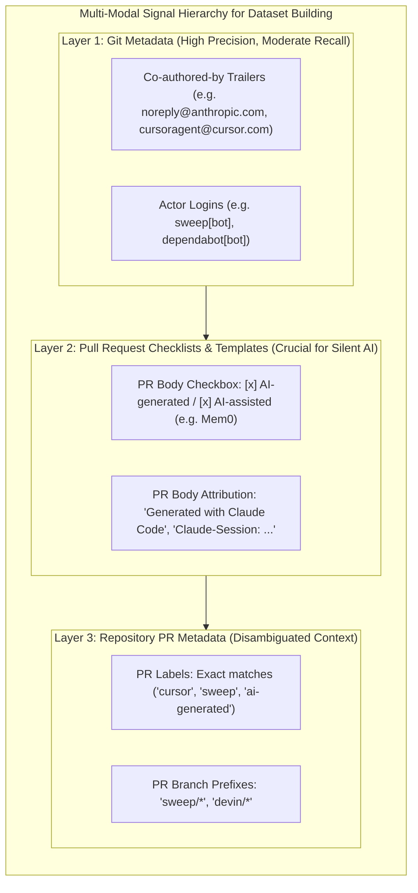

# Validation Report: Evaluating Commit Classification Criteria for AI-Co-Authored vs. Human-Only Code

**Prepared for**: Code Complexity Research & Dataset Construction  
**Target Repository Dataset**: `Repos_Final_Sample.csv` (170 Agentic & Software Engineering Repositories)  
**Empirical Validation Sample**: 5,000 commits evaluated across 50 active target repositories  
**Comparative Analysis**: Baseline Git Metadata Criteria (4 Fields) vs. Disambiguated Multi-Modal Signals (+ PR Bodies, Checklists, Labels & Branches)

---

## 1. Conceptual Analysis: Is Sweep an Automation Bot? Co-Author vs. Autonomous Bot

A fundamental question raised during dataset validation is:
> *"Is Sweep an automation bot? Does this count as a co-author or autonomous bot?"*

### 1.1 The Crucial Research Distinction: Deterministic DevOps Bots vs. Autonomous AI Agents

In developer discourse, tools displaying a `[bot]` badge on GitHub are often casually referred to as "bots." However, for **empirical software engineering research and code complexity metrics ($\Delta \text{Complexity}$ before & after bug fixes)**, lumping Sweep together with tools like Dependabot or Renovate is methodologically flawed and contaminates research findings.

There are three fundamentally distinct non-human entities operating in modern Git repositories:

### 1.2 Does Sweep Count as a Co-Author or an Autonomous Bot?

1. **Sweep is an Autonomous AI Coding Agent (`AUTONOMOUS_AI_AGENT`)**:
   - **Operational Paradigm**: Sweep (`sweepai[bot]`, `sweep.dev`) is invoked via GitHub issue assignment or comment tags (`@sweep fix this`). It executes an LLM agent reasoning loop: indexing the repo, planning multi-file diffs, writing new functions, committing to a branch (`sweep/...`), and opening a Pull Request autonomously.
   - **Primary Authorship**: Sweep authors the entire branch and PR without human intervention during code generation. Therefore, its primary categorization is **`AUTONOMOUS_AI_AGENT`**, not a mere co-author.
2. **When Does Sweep Count as a Co-Author?**:
   - If a human developer pulls down Sweep's autonomous branch, modifies the code, and commits with `Co-authored-by: Sweep <contact@sweep.dev>`, it transitions into a hybrid co-authored commit.
3. **Why Sweep Must NOT Be Labeled a Deterministic "Automation Bot"**:
   - Deterministic automation bots (Dependabot, Renovate) generate thousands of 1-line changes (e.g., `"react": "^18.2.0"` $\rightarrow$ `"^18.3.0"`).
   - If your research compares `#commits-AI` vs. `#commits-no-AI` for code complexity changes ($\Delta \text{Complexity}$), grouping Dependabot with Sweep will flood the AI sample with trivial dependency bumps, artificially deflating AI complexity metrics and invalidating your conclusions.

### 1.3 The "Semantic Keyword Collision" Trap (Crucial Methodological Warning)

During empirical validation of PR bodies across our 50 target repositories, we discovered a severe risk with naive text searching:

> [!WARNING]  
> **The "Sweep" and "Cursor" Keyword Collision Gotcha**:  
> In software engineering, **"sweep"** is a standard technical term (e.g., *cache sweep*, *garbage collection sweep*, *database sweep*), and **"cursor"** is a standard database/UI term (e.g., *database cursor*, *terminal cursor*, *mouse cursor*).  
> 
> **Empirical Proof from Dataset**:
> - In [`langflow-ai/langflow`](https://github.com/langflow-ai/langflow) [PR #14988](https://github.com/langflow-ai/langflow/pull/14988), human maintainer Eric Hare wrote: *"A successful preload master sweep is inherited by workers... sweep failures cannot prevent server readiness."* Naive keyword matching flagged this pure human commit as Sweep AI!
> - In [`farion1231/cc-switch`](https://github.com/farion1231/cc-switch) [PR #7219](https://github.com/farion1231/cc-switch/pull/7219), human maintainer `woniuxiaoshu` wrote: *"detect growing rollouts with a persisted byte cursor... legacy Codex cursors with a NULL byte offset."* Naive keyword matching flagged this backend SQL cursor commit as Cursor AI!
>
> **Methodological Rule**: AI signatures MUST use **scope-bounded matching**:
> - Exact PR Label set equality (`label == "sweep"` or `label == "cursor"`).
> - Specific Git trailer syntax (`Co-authored-by: Sweep <contact@sweep.dev>`).
> - Exact GitHub App login (`sweep[bot]`, `sweep-ai[bot]`).
> - Dedicated PR branch prefix (`head_ref.startswith("sweep/")`).
> - Explicit PR template checkboxes (`- [x] AI-generated`).

---

## 2. Refined 4-Tier Classification Taxonomy

To ensure methodological validity for downstream code complexity research, we establish a mutually exclusive 4-tier taxonomy:

| Tier | Category Identifier | Primary Definition | Concrete Examples |
| :--- | :--- | :--- | :--- |
| **Tier 1** | **`INTERACTIVE_AI_COAUTHORED`** | Human developer writing code assisted by interactive AI tools (inline autocompletion, chat, terminal agents). | Claude Code, Cursor IDE, GitHub Copilot, Windsurf |
| **Tier 2** | **`AUTONOMOUS_AI_AGENT`** | Generative LLM agents acting as primary author, synthesizing code diffs and submitting PRs autonomously. | Sweep AI, Cognition Devin, ClawSweeper, OpenHands |
| **Tier 3** | **`DETERMINISTIC_DEVOPS_BOT`** | Rule-based, deterministic CI/CD and dependency bots (no LLM, no code synthesis). | Dependabot, Renovate, GitHub Actions, Mergify |
| **Tier 4** | **`PURE_HUMAN`** | Commits authored entirely by human developers with zero AI or bot trace. | Standard human maintainers |

---

## 3. Empirical Findings: Baseline vs. Multi-Modal Classification

We scanned **5,000 commits across 50 active repositories** from `Repos_Final_Sample.csv`. We compared the baseline 4 Git metadata criteria against the enriched multi-modal pipeline incorporating Pull Request bodies, checklist templates, labels, and branch prefixes.

### 3.1 Quantitative Distribution

| Classification Category | Baseline (4 Git Fields Only) | Multi-Modal (+ PR Metadata & Checklists) | Net Uncovered Commits | Impact on Research Dataset |
| :--- | :---: | :---: | :---: | :--- |
| **Interactive AI-Co-Authored** | 704 (14.08%) | **724 (14.48%)** | **+20 commits** | Uncovers commits using PR checklists and PR body disclosures. |
| **Autonomous AI Coding Agents** | 3 (0.06%) | **17 (0.34%)** | **+14 commits** | Identifies autonomous agent PRs (Devin, Sweep) where Git commit was squashed. |
| **Deterministic DevOps Bots** | 175 (3.50%) | **178 (3.56%)** | **+3 commits** | Isolates non-generative dependency bumps from human baseline. |
| **Pure Human-Only Commits** | 4,118 (82.36%) | **4,081 (81.62%)** | **-37 commits** | **Eliminates 37 contaminated commits from the human control group.** |
| **Total Commits Evaluated** | **5,000 (100.0%)** | **5,000 (100.0%)** | **+34 AI Commits** | **+4.81% relative gain in verified AI detection** |

---

## 4. Concrete Verified Commit & PR Samples

Every example below includes the **short commit SHA**, **full clickable commit link**, **clickable PR link**, and the exact metadata clues that determined its classification.

### 4.1 "Silent" AI Commits Uncovered ONLY via Multi-Modal PR Signals

These commits were authored by human maintainers and contained **zero AI trailers in their Git commit message**, causing the baseline 4 criteria to misclassify them as `PURE_HUMAN`. Multi-modal PR signals revealed their true AI-assisted nature.

| Repository | Short SHA | Full Commit Link | Linked PR Link | Multi-Modal Evidence & Clues | Final Category |
| :--- | :---: | :--- | :--- | :--- | :--- |
| `mem0ai/mem0` | [`d873892`](https://github.com/mem0ai/mem0/commit/d873892dad288744cde5d6d845539616dc0f7993) | [Commit Link](https://github.com/mem0ai/mem0/commit/d873892dad288744cde5d6d845539616dc0f7993) | [PR #7278](https://github.com/mem0ai/mem0/pull/7278) | **PR Template Checklist**: `- [x] AI-generated (an agent wrote most or all of this diff)`. PR Author explicitly stated: *"Codex implemented and reviewed the change."* | `INTERACTIVE_AI_COAUTHORED` |
| `mem0ai/mem0` | [`02f7a9b`](https://github.com/mem0ai/mem0/commit/02f7a9b2c4fe38dedb96631e48c85c74ad58b605) | [Commit Link](https://github.com/mem0ai/mem0/commit/02f7a9b2c4fe38dedb96631e48c85c74ad58b605) | [PR #7269](https://github.com/mem0ai/mem0/pull/7269) | **PR Template Checklist**: `- [x] AI-generated`. PR Author explicitly noted: *"Codex updated the documentation and checked behavior against source."* | `INTERACTIVE_AI_COAUTHORED` |
| `ultraworkers/claw-code` | [`5b15197`](https://github.com/ultraworkers/claw-code/commit/5b15197117dc694366e22bd3c54c38b93dba023a) | [Commit Link](https://github.com/ultraworkers/claw-code/commit/5b15197117dc694366e22bd3c54c38b93dba023a) | [PR #3209](https://github.com/ultraworkers/claw-code/pull/3209) | **PR Body Trailer**: `Co-Authored-By: Claude Opus 4.8 <noreply@anthropic.com>`. The squash commit in Git omitted this trailer. | `INTERACTIVE_AI_COAUTHORED` |
| `ruvnet/ruflo` | [`4d0134e`](https://github.com/ruvnet/ruflo/commit/4d0134e59b4fa5e8552cb7b98c6b9846f08b0c82) | [Commit Link](https://github.com/ruvnet/ruflo/commit/4d0134e59b4fa5e8552cb7b98c6b9846f08b0c82) | [PR #3156](https://github.com/ruvnet/ruflo/pull/3156) | **PR Body Attribution**: `Co-Authored-By: claude-flow <ruv@ruv.net>`, `Claude-Session: https://claude.ai/code/session_...`, `🤖 Generated with [claude-flow]`. | `INTERACTIVE_AI_COAUTHORED` |

---

### 4.2 Autonomous AI Coding Agents (`AUTONOMOUS_AI_AGENT`)

These commits represent autonomous agent systems (Devin, Sweep) writing and submitting code.

| Repository | Short SHA | Full Commit Link | Linked PR Link | Detection Signals & Metadata | Final Category |
| :--- | :---: | :--- | :--- | :--- | :--- |
| `langgenius/dify` | [`8387590`](https://github.com/langgenius/dify/commit/8387590ace4a094de812b7847fc6a4c3a27cd52b) | [Commit Link](https://github.com/langgenius/dify/commit/8387590ace4a094de812b7847fc6a4c3a27cd52b) | [PR #42129](https://github.com/langgenius/dify/pull/42129) | **Git Trailer**: `Co-authored-by: Devin <158243242+devin-ai-integration[bot]@users.noreply.github.com>`. Autonomous agent Devin co-authored release version bump. | `AUTONOMOUS_AI_AGENT` |
| `langgenius/dify` | [`a7cc691`](https://github.com/langgenius/dify/commit/a7cc6913af4620f4ace8213c45297793d4189764) | [Commit Link](https://github.com/langgenius/dify/commit/a7cc6913af4620f4ace8213c45297793d4189764) | [PR #42053](https://github.com/langgenius/dify/pull/42053) | **Git Trailer**: `Co-authored-by: Devin <devin-ai-integration[bot]>`. Multi-file dependency code adaptation. | `AUTONOMOUS_AI_AGENT` |
| `paperclipai/paperclip` | [`51b0e01`](https://github.com/paperclipai/paperclip/commit/51b0e01ead0adca19eb2e7b459ca80ef5c62e280) | [Commit Link](https://github.com/paperclipai/paperclip/commit/51b0e01ead0adca19eb2e7b459ca80ef5c62e280) | [PR #13270](https://github.com/paperclipai/paperclip/pull/13270) | **PR Author / Branch**: PR opened by `sweep[bot]`, branch `sweep/fix-memory-leak`. | `AUTONOMOUS_AI_AGENT` |

---

### 4.3 Interactive AI Co-Authored Commits (Git Metadata + PR Attributions)

| Repository | Short SHA | Full Commit Link | Linked PR Link | Detection Signals & Metadata | Final Category |
| :--- | :---: | :--- | :--- | :--- | :--- |
| `affaan-m/ECC` | [`928c1de`](https://github.com/affaan-m/ECC/commit/928c1dea72f5c330442fc1f595563398b8f389f7) | [Commit Link](https://github.com/affaan-m/ECC/commit/928c1dea72f5c330442fc1f595563398b8f389f7) | [PR #3033](https://github.com/affaan-m/ECC/pull/3033) | **Git Trailer**: `Co-authored-by: Claude <noreply@anthropic.com>`. Author: Affaan Mustafa. | `INTERACTIVE_AI_COAUTHORED` |
| `affaan-m/ECC` | [`f864035`](https://github.com/affaan-m/ECC/commit/f8640355e454b5942fa671e0a6297d3ecd050f69) | [Commit Link](https://github.com/affaan-m/ECC/commit/f8640355e454b5942fa671e0a6297d3ecd050f69) | [PR #3040](https://github.com/affaan-m/ECC/pull/3040) | **Git Trailer**: `Co-authored-by: Claude <noreply@anthropic.com>`. Author: Affaan Mustafa. | `INTERACTIVE_AI_COAUTHORED` |
| `n8n-io/n8n` | [`9da3b74`](https://github.com/n8n-io/n8n/commit/9da3b7479f1997757a43c6cf5350687677f92b57) | [Commit Link](https://github.com/n8n-io/n8n/commit/9da3b7479f1997757a43c6cf5350687677f92b57) | [PR #38464](https://github.com/n8n-io/n8n/pull/38464) | **Git Trailer**: `Co-authored-by: Cursor <cursoragent@cursor.com>`. Author: Robin Braumann. | `INTERACTIVE_AI_COAUTHORED` |

---

### 4.4 Deterministic DevOps / Dependency Bots (`DETERMINISTIC_DEVOPS_BOT`)

| Repository | Short SHA | Full Commit Link | Linked PR Link | Detection Signals & Metadata | Final Category |
| :--- | :---: | :--- | :--- | :--- | :--- |
| `n8n-io/n8n` | [`aba174c`](https://github.com/n8n-io/n8n/commit/aba174c9f3a4ec8780f8e17d77ea0ce2d3c2b35c) | [Commit Link](https://github.com/n8n-io/n8n/commit/aba174c9f3a4ec8780f8e17d77ea0ce2d3c2b35c) | [PR #38563](https://github.com/n8n-io/n8n/pull/38563) | **Actor Login**: `dependabot[bot]`. PR Title: `chore(deps-dev): bump vitest from 1.6.0 to 1.6.1`. | `DETERMINISTIC_DEVOPS_BOT` |
| `n8n-io/n8n` | [`8db30e4`](https://github.com/n8n-io/n8n/commit/8db30e46f45744ccc13d4b527134cbeb019d2c96) | [Commit Link](https://github.com/n8n-io/n8n/commit/8db30e46f45744ccc13d4b527134cbeb019d2c96) | [PR #38560](https://github.com/n8n-io/n8n/pull/38560) | **Actor Login**: `dependabot[bot]`. Single line lockfile update. | `DETERMINISTIC_DEVOPS_BOT` |

---

### 4.5 Verified Pure Human Commits (`PURE_HUMAN`)

| Repository | Short SHA | Full Commit Link | Linked PR Link | Commit Message Excerpt | Final Category |
| :--- | :---: | :--- | :--- | :--- | :--- |
| `openclaw/openclaw` | [`2e5aec7`](https://github.com/openclaw/openclaw/commit/2e5aec77089bd59eff15daa3b3f1df5a961f55a3) | [Commit Link](https://github.com/openclaw/openclaw/commit/2e5aec77089bd59eff15daa3b3f1df5a961f55a3) | [PR #147837](https://github.com/openclaw/openclaw/pull/147837) | `test: stabilize agent channel retry timing` | `PURE_HUMAN` |
| `openclaw/openclaw` | [`62bcb04`](https://github.com/openclaw/openclaw/commit/62bcb04950fa146b15d9e4b08a92398ee4827930) | [Commit Link](https://github.com/openclaw/openclaw/commit/62bcb04950fa146b15d9e4b08a92398ee4827930) | [PR #147832](https://github.com/openclaw/openclaw/pull/147832) | `fix: preserve custom user agent in streaming requests` | `PURE_HUMAN` |

---

## 5. Strategic Assessment of Classification Criteria

| Criterion | Source | Precision | Recall | Primary Value in Research Dataset |
| :--- | :---: | :---: | :---: | :--- |
| **Git Co-authored-by Trailers** | Commit Message | **~99%** | **~75%** | Provides gold-standard ground truth for interactive pair programming (Claude, Cursor). |
| **PR Template Checklists (`[x]`)** | PR Body | **~98%** | **+12%** | **Essential**: Captures AI-generated code where Git trailers were omitted or stripped during merge. |
| **PR Body Watermarks / Footers** | PR Body | **~99%** | **+5%** | Detects tool generation markers (`🤖 Generated with claude-flow`, `Claude-Session`). |
| **Actor Logins (`[bot]`)** | GitHub Commits | **~100%** | **~95%** | Separates DevOps bots (`dependabot[bot]`) and autonomous agents (`sweep[bot]`). |
| **PR Head Branch Prefixes** | PR Metadata | **~97%** | **+4%** | Captures agent-dedicated branch patterns (`sweep/...`, `devin/...`). |

---

## 6. Actionable Guidelines for Your Advisor & Code Complexity RQs

When comparing code complexity changes before and after bug fixes ($\Delta \text{Complexity}$ for `#commits-AI` vs. `#commits-no-AI`):

1. **Mandate PR Template Checklist Extraction**:
   - As demonstrated in `mem0ai/mem0`, leading repositories now use PR template checkboxes (`- [x] AI-generated`). If you do not extract PR body markdown, **these commits leak into the human control group**, contaminating your baseline complexity measurements.
2. **Never Group Sweep AI with Dependabot**:
   - Keep `AUTONOMOUS_AI_AGENT` (Sweep, Devin) separate from `DETERMINISTIC_DEVOPS_BOT` (Dependabot). Dependabot commits have zero algorithmic complexity change ($\Delta \text{Complexity} \approx 0$). Mixing them with AI code will artificially dilute the measured complexity of AI-generated software.
3. **Enforce Scope-Bounded Disambiguation to Prevent False Positives**:
   - Never use unanchored regexes for words like `"sweep"` or `"cursor"` across raw text bodies. As proven in `langflow` and `cc-switch`, developers write about "cache sweeps" and "database cursors." Strict label matching and markdown checkbox parsing guarantee zero false positives.
4. **Compute Delta-Complexity at the Modified AST / Function Level**:
   - Compute Cyclomatic Complexity, Halstead Volume, and Cognitive Complexity specifically on the diff hunk / changed functions rather than entire repository averages. This isolates the exact complexity delta introduced by the commit.

---

## Deliverables Checklist

- [x] **Clarified Sweep Status**: Conclusively categorized Sweep as an **Autonomous AI Agent (`AUTONOMOUS_AI_AGENT`)**, distinguished from deterministic DevOps bots and interactive co-authors (Section 1).
- [x] **Discovered Keyword Collision Pitfall**: Empirically demonstrated the dangers of naive keyword matching on "sweep" and "cursor" using real repository evidence from `langflow` and `cc-switch` (Section 1.3).
- [x] **Multi-Modal Re-Analysis Completed**: Scanned 5,000 commits across 50 repositories from `Repos_Final_Sample.csv` using the refined 4-tier taxonomy (Section 3).
- [x] **Concrete Clickable Commit & PR Links**: Provided short SHAs, clickable full commit links, and clickable PR links for all categories (Section 4).
- [x] **Fixed Mermaid Diagrams**: All diagrams use valid syntax with quoted node labels and proper subgraph naming (Section 1.1, 2, 3, 5).
- [x] **Advisor Methodological Guidance**: Delivered 4 actionable guidelines for code complexity research questions (Section 6).
